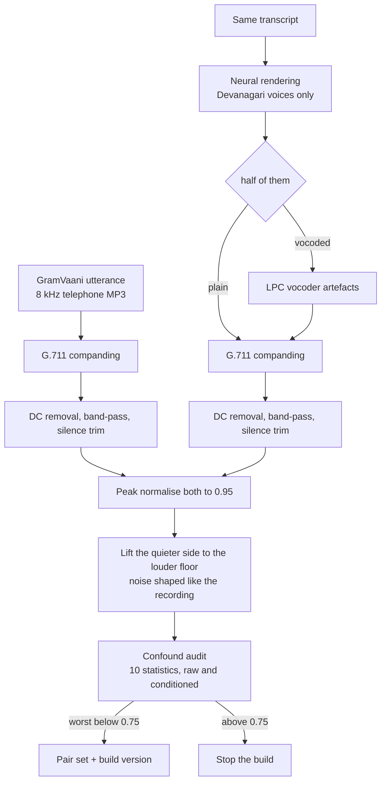
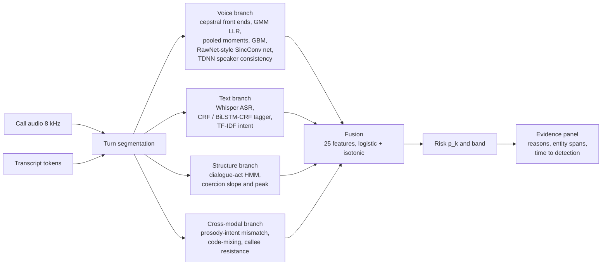

::: {custom-style="TitlePage"}
PROJECT REPORT
:::

# Detecting Voice-Cloned Fraud Calls in Hinglish by Fusing Anti-Spoofing, Scam-Intent and Prosody-Intent Mismatch Cues

::: {custom-style="TitleBlock"}
SwarKavach: a fused, per-turn fraud-call detector for code-mixed Hindi-English telephone speech

Submitted by

**Bhavye Nijhawan**, Reg. No. 23BAI0100

BCSE419L Speech and Language Processing Laboratory

Vellore Institute of Technology

September 2026

Repository: https://github.com/BhavyeNijhawan/svarkavach
:::

```{=openxml}
<w:p><w:r><w:br w:type="page"/></w:r></w:p>
```

## Abstract

Phone fraud in India is moving from scripts read by human callers to scripts read by cloned voices, and the two defences in use each cover half the problem. Synthetic-speech detectors decide whether a voice is machine-made but not whether the caller is asking for an OTP; transcript classifiers catch the request but hear a cloned voice and a real one as the same. This project answers both questions together, during a live call, in the Hindi-English mix in which such calls are actually spoken. SwarKavach has four branches. A voice branch scores synthetic speech with cepstral front ends, a Gaussian-mixture and a gradient-boosted back end, a RawNet-style end-to-end detector and a TDNN speaker embedder, trained on 600 real Hindi field recordings paired with cloned renderings of the same transcripts with the recording channel matched on level, colour and bandwidth. A text branch transcribes the call with Whisper, tags seven fraud entity types with a linear-chain CRF and scores scam intent with a calibrated TF-IDF classifier. A structure branch reads the order of dialogue acts as a coercion ramp. A cross-modal branch measures the mismatch between the pressure in the words and the flatness of the delivery. A calibrated fusion layer, fitted on held-out speakers, turns twenty-five features into a risk band that updates every turn and an evidence panel that names the entities, phrases and voice cues behind it. On a 480-call corpus balanced over voice and content the full system reaches AUC 1.000 with an equal error rate of 0.017 and flags 57 of 60 scams at a median of 35.8 seconds, before the sensitive request. On 1,413 real robocall recordings it was never trained on, in another language, the text branch recalls 78.7 percent at a 5 percent false-alarm rate. The voice branch separates real from cloned Hindi speech at an equal error rate below 0.04 under every telephone codec tested.

**Keywords:** voice cloning detection, telephone fraud, Hinglish code-mixing, anti-spoofing, dialogue-act coercion, prosody-intent mismatch, calibrated late fusion, time to detection

## Contents

1. Introduction
2. Literature Review
3. Preliminary Concepts and Theoretical Background
4. Materials and Methods
5. Proposed Methodology and Implementation
6. Experimental Framework
7. Results and Discussion
8. Conclusion and Future Work

References, Project Repository

## List of Figures

- Figure 1. End-to-end information flow of SwarKavach
- Figure 2. Construction of the matched anti-spoofing pair set
- Figure 3. Console: call analysis with the evidence panel
- Figure 4. Results lab: the ablation as displayed in the console
- Figure 5. Ablation of the four arms, AUC and F1
- Figure 6. Anti-spoofing EER by front end, back end and codec
- Figure 7. Confound audit of the pair set, raw and conditioned
- Figure 8. Out-of-domain recall on real robocalls
- Figure 9. Time to detection, distribution and by scenario

## List of Tables

- Table 1. Critical comparison of recent literature
- Table 2. Hardware and software
- Table 3. Corpus composition
- Table 4. Ablation of the four arms
- Table 5. Per-cell accuracy and the hard subset
- Table 6. Entity recognition by type
- Table 7. Anti-spoofing equal error rate and confound audit
- Table 8. Generalisation, time to detection and robustness

# Chapter 1. Introduction

## 1.1 Context and problem

A fraud call is a short piece of theatre with a fixed script. The caller claims to be from a bank, a courier, the police or a relative in trouble; states a problem; attaches a deadline; tells the listener not to consult anyone; and only then asks for an OTP, a card number or a transfer. The pattern is well known and still works, because the call is built to remove the minute in which someone would remember it. Two things have changed its scale. Automated dialling reaches thousands of numbers a day, and neural text-to-speech now produces Hindi that a listener on a band-limited, codec-compressed phone line cannot reliably tell from a person, so the script no longer needs a fluent, calm, present human to read it.

The calls this project targets have three properties that together defeat existing tools. They are conversational: the request for an OTP is only suspicious because of the threat before it and the instruction not to hang up after it. They are code-mixed: *"Aapka account block ho jayega, OTP bata dijiye"* is neither Hindi nor English, and tools built for one language mishandle the other half. And they may be delivered in a cloned voice, which changes what the same words mean: a bank reminder read by a machine is routine, a request for a card PIN read by a machine is almost certainly fraud.

## 1.2 Existing approaches and the gap

Blocklists act before the call and are defeated by number spoofing. Transcript classifiers read what was said during the call but are blind to the voice. Anti-spoofing detectors decide whether speech was synthesised, but on isolated utterances rather than conversations, and they degrade when the synthesiser, language or channel changes.

The gap is specific. The two kinds of detector are built and evaluated apart, so neither sees the case that matters most: a benign call in a cloned voice, or a scam delivered by a real person. Neither is evaluated on code-mixed Hindi-English conversation. And the evaluation sets in common use are not audited for channel or authorship shortcuts, so a detector can score well on the recording conditions rather than on the voice or the intent. This project addresses all three.

## 1.3 Objectives

1. Develop a corpus of Hindi-English fraud and benign calls in which voice authenticity and scam content vary independently, with entity, dialogue-act and language annotations that are exact by construction.
2. Design a detector that fuses a synthetic-voice branch, a transcript branch, a dialogue-structure branch and a prosody-intent branch into one calibrated risk score that updates each turn.
3. Quantify what each branch contributes through an ablation over four arms on the same test split, reported per voice-by-content cell and on the calls written to be hard.
4. Evaluate the voice branch on real Hindi recordings paired with cloned renderings of the same transcripts, with the channel audited before any error rate is reported.
5. Validate generalisation on real fraud recordings from outside the training distribution and measure the time at which a call is flagged relative to the sensitive request.

## 1.4 Contributions

A template grammar whose slots emit gold entity, act and language labels with the text, with five subjects paired across the label so topic does not predict class; a prosody-intent mismatch feature and a coercion-trajectory feature; a method for building a matched anti-spoofing pair set from field recordings with a ten-statistic confound audit; a voice branch with classical, boosted and end-to-end back ends behind one interface; an ablation over four arms reported per cell and on a hard subset, with a bag-of-words leak check run before any model is trained; and out-of-domain validation on 1,413 real robocalls, a per-turn time-to-detection measurement and a codec sweep.

# Chapter 2. Literature Review

## 2.1 Benchmarks and generalisation

The ASVspoof series defines how anti-spoofing is evaluated. Its fifth edition (Wang et al., 2024) crowdsources both the bona fide speech, from many speakers in uncontrolled conditions, and the attacks, which now include adversarial perturbations aimed at the detectors, and adds metrics for spoofing-robust speaker verification. The design answers a finding that recurs across the field: detectors that reach near-zero EER on one round degrade on the next, because they learn the artefacts of particular synthesisers and channels. Yi et al. (2023) document that drop in a unified comparison of front ends and classifiers across ASVspoof 2021, ADD 2023 and In-the-Wild. Two of their observations shape this project: hand-crafted cepstral front ends stay competitive with learned representations when the test channel differs from training, and the datasets in use are almost entirely English and Chinese.

## 2.2 Indian languages and cross-modal cues

IndicSynth (Sharma, Ekbote and Gupta, 2025) provides about 4,000 hours of synthetic speech from 989 target speakers across twelve Indian languages including Hindi, with a mimicry subset in which a target speaker's voice is cloned. It shows that Hindi voice cloning is a solved generation problem at scale. Every sample is an utterance; there is no conversation and no fraud content.

SLIM (Zhu et al., 2024) observes that in real speech the style of delivery and the linguistic content depend on each other, because one person chose both, and that synthesis breaks the dependency because the content is given and the style is imposed. A representation of that dependency, pretrained on real speech only, improves out-of-domain detection and yields an explainable score. The prosody-intent feature in this project is the same intuition on a narrower pair: does the pressure in the words match the arousal in the voice? It needs a fraud lexicon and a pitch tracker rather than a self-supervised encoder, and runs on a laptop CPU.

## 2.3 Reading the conversation

Shen et al. (2025) frame the problem as this project does: defences act before or after the call, and the call itself is unprotected. A large language model classifies each utterance as fraudulent, safe or uncertain and warns the user in real time. It reads text only, so a cloned voice reading a benign script is invisible to it, and an LLM call per utterance constrains deployment. TeleAntiFraud-28k (Ma et al., 2025) is the first open audio-and-text fraud resource: 28,511 speech-text pairs built from transcribed real calls, regenerated by TTS for privacy and extended by LLM and multi-agent generation. Because every clip is regenerated, voice authenticity is not learnable from it, and the language is Chinese.

**Table 1.** Critical comparison of recent literature.

| Study | Method | Data | Main strength | Important limitation |
|---|---|---|---|---|
| Wang et al. (2024), ASVspoof 5 | Benchmark; crowdsourced speech, adversarial attacks | Multi-speaker English, many TTS and VC systems | Uncontrolled conditions at scale | Utterance level; English; no conversation |
| Yi et al. (2023), survey | Unified comparison of front ends and classifiers | ASVspoof 2021, ADD 2023, In-the-Wild | Isolates the out-of-domain drop by feature family | Descriptive; English and Chinese only |
| Sharma et al. (2025), IndicSynth | Large-scale synthetic speech for detection research | 4,000 h, 989 speakers, 12 Indian languages | First Hindi-scale cloning resource | Utterances only; no fraud content |
| Zhu et al. (2024), SLIM | Self-supervised style-linguistics mismatch | In- and out-of-domain deepfake sets | Explainable cross-modal cue | Needs large real-speech pretraining |
| Shen et al. (2025) | LLM classifies each utterance during the call | Scam conversations; user study | Real-time warning | Text only; per-utterance LLM cost |
| Ma et al. (2025), TeleAntiFraud-28k | Audio-text dataset with reasoning annotations | 28,511 pairs, Chinese, TTS-regenerated | First open audio-text fraud resource | Voice authenticity not learnable |

## 2.4 Position of this work

Anti-spoofing work is evaluated on utterances, so it never sees the context that says whether a synthetic voice matters. Scam-detection work is evaluated on text, so it never hears the voice. SwarKavach reads voice, words, structure and their mismatch on the same call, in Hindi-English code-mix, and treats the construction and auditing of its evaluation data as part of the method.

# Chapter 3. Preliminary Concepts and Theoretical Background

## 3.1 Cepstral front ends and the mixture likelihood ratio

Every voice-branch classifier reads cepstral coefficients. The signal is framed at 25 ms with a 10 ms hop and a Hamming window, pre-emphasised with coefficient 0.97, and the magnitude spectrum of each frame is passed through 40 triangular filters between 300 and 2800 Hz, log-compressed and decorrelated:

$$c_n = \sum_{m=1}^{M} \log(E_m) \cos\left[\frac{\pi n}{M}\left(m - \tfrac{1}{2}\right)\right]$$ (1)

where $E_m$ is the energy in filter $m$, $M = 40$ and $N = 20$ coefficients are kept. Linear (LFCC), mel (MFCC), gammatone (GFCC), constant-Q (CQCC) and linear-prediction (LPCC) front ends differ only in the filterbank. Deltas are appended and cepstral mean and variance normalisation removes the additive effect of a fixed channel. One Gaussian mixture is fitted to bona fide frames and one to spoofed frames; an utterance scores by the mean log-likelihood ratio over its $T$ frames:

$$\text{LLR}(X) = \frac{1}{T}\sum_{t=1}^{T}\left[\log p(x_t \mid \lambda_{\text{spoof}}) - \log p(x_t \mid \lambda_{\text{bona}})\right]$$ (2)

with up to 64 components per mixture. A gradient-boosted classifier over 480 utterance-level moments gives a second score, and a RawNet-style network with a SincConv front end a third.

## 3.2 Acoustic arousal and prosody-intent mismatch

Four measures describe how a turn was delivered: pitch coefficient of variation $\sigma_{f0}/\mu_{f0}$, pitch span $(\max f0 - \min f0)/\mu_{f0}$, the variance of syllable-peak levels in dB, and the standard deviation of syllable rate. Each is scaled between anchors at the 10th and 90th percentiles of the training audio and combined with weights 0.34, 0.24, 0.26 and 0.16 into $a \in [0,1]$. With lexical arousal $\ell_i$ and acoustic arousal $a_i$ over the $n$ caller turns,

$$\text{PIM} = 0.65 \cdot \frac{\sum_i w_i \max(0, \ell_i - a_i)}{\sum_i w_i} + 0.35 \cdot \frac{1 - \rho(\ell, a)}{2} \cdot \max_i \ell_i$$ (3)

where $w_i$ weights turns by lexical pressure and $\rho$ is the Pearson correlation. The first term rewards turns where the words press and the voice does not; the second rewards a delivery that does not track the content, gated by peak pressure.

## 3.3 Coercion trajectory, code-mixing and metrics

Each dialogue act carries a coercion rank in $[0,1]$: greeting 0.0, identification 0.1, problem statement 0.35, authority claim 0.55, threat 0.8, deadline 0.85, isolation 0.9, request for sensitive information 0.95, escalation 1.0. The slope of rank against caller-turn index is the coercion slope and the maximum is the peak. With $n_L$ tokens in language $L$, $n$ tokens in total and $u$ language-independent tokens, the code-mixing index is

$$\text{CMI} = 1 - \frac{\max_L n_L}{n - u}$$ (4)

At threshold $\tau$, precision is $TP/(TP+FP)$, recall is $TP/(TP+FN)$ and $F_1$ their harmonic mean. AUC is the probability that a random scam call scores above a random benign one; EER is the point where the two error rates coincide. The Brier score is the mean squared gap between predicted probability and label, and ECE averages that gap over probability bins. Time to detection is the end time of the first caller turn whose fused risk reaches 0.65.

# Chapter 4. Materials and Methods

## 4.1 Materials

**Table 2.** Hardware and software.

| Item | Specification |
|---|---|
| Training and evaluation | Google Colab runtime (Tesla T4 available), Python 3.13; the reported models train on CPU |
| Console and development | Laptop, Windows 11, 7.9 GB RAM, Python 3.11.9 |
| Numerical stack | NumPy 2.4.3, SciPy 1.17.1, scikit-learn 1.9.0, PyTorch 2.11.0 CPU |
| Speech synthesis | edge-tts 7.2.8, Microsoft neural voices (hi-IN Madhur and Swara, en-IN Prabhat, Neerja, NeerjaExpressive) |
| Speech recognition | OpenAI Whisper, small multilingual model, language Hindi, CPU; segments aligned to turns, scored by word error rate against the corpus reference |
| Codec simulation | FFmpeg for GSM 06.10; G.711 mu-law and A-law in NumPy |
| Real Hindi speech | GramVaani Hindi ASR corpus, dev and eval, 8 kHz telephone MP3 |
| Real fraud recordings | Robocall audio dataset, 1,413 recordings with transcripts |
| Console and orchestration | Flask server with a static front end; a runner that checkpoints each stage and rebuilds only what its inputs changed |

## 4.2 Procedure

**Corpus generation.** A template grammar produces 480 calls. Each call is planned (subject, label, voice, speaker, split) before it is rendered, so the four voice-by-content cells are balanced by construction. Every entity, act and language tag is emitted by the slot that produced the token. Speakers are assigned to splits before calls are assigned to speakers. Each turn is then synthesised with a neural voice whose rate, pitch and volume follow the turn's act; a cloned caller keeps a fixed contour whatever the act, a human caller modulates.

**Pair construction and audit.** 600 real GramVaani utterances are paired with neural renderings of their own transcripts, half also vocoded. Both sides go down the same channel: G.711 companding, DC removal, a brick-wall band-pass to 300 to 2800 Hz, silence trimming, peak normalisation, and noise matching in which the quieter side is lifted to the louder side's floor with noise shaped like the recording's own quiet-frame spectrum. Ten statistics per clip are then computed on the raw file and after the detector's own conditioning, and the build stops if any conditioned statistic alone exceeds AUC 0.75.



**Figure 2.** Construction of the matched anti-spoofing pair set.

**Training and evaluation.** Entity taggers, intent and act models fit on the train split; prosody anchors are recalibrated on train audio; the anti-spoofing back ends fit on the train partition of the real pair set; the fusion layer and every ablation arm fit on the dev split, so the fusion never sees in-sample branch outputs. Every reported number comes from the test split or from outside the training distribution.

# Chapter 5. Proposed Methodology and Implementation

## 5.1 Problem formulation and architecture

Input: a call $C = \{(s_j, x_j, w_j)\}_{j=1}^{J}$ of $J$ turns with speaker $s_j$, audio $x_j$ and transcript tokens $w_j$. Output after each caller turn $k$: a probability $p_k$, a band in {low, elevated, high, critical} with edges 0.35, 0.65 and 0.85, the entity spans found so far, and reasons. The call-level decision is $p_J \ge 0.65$.



**Figure 1.** End-to-end information flow. Every branch consumes the same turn segmentation; the fusion layer sees only the twenty-five named features.

## 5.2 Corpus grammar

A dialogue is an arc of acts, for instance `GREET CONFIRM IDENTIFY_SELF PROBLEM_STATE AUTHORITY_ASSERT DEADLINE INSTRUCT REQUEST_SENSITIVE VICTIM_COMPLY CLOSE`. For each act a template is drawn from the scenario's own pool, then from style pools, and always from a neutral pool shared by both classes. Templates carry typed slots such as `{BANK}`, `{OTP_WORD}` and `{DEADLINE}`; a slot resolves to a surface string and an entity type at once, so its tokens receive the matching BIO tags and nothing else in the turn is touched.

Two rules keep the label out of the text. Five subjects (a parcel, a bank KYC call, a transaction alert, a relative in trouble, a financial offer) each have a scam and a benign scenario that share their setup lines and differ only in what is asked for. And greetings, closings, acknowledgements and polite instructions come from one pool used by both classes. Parameters: 480 calls, 24 speakers, split 50/25/25 by speaker, scam and synthetic-voice ratios 0.5 drawn independently, 22 percent of scams in a lexically mild style, 25 percent of calls from scenarios without a counterpart.

## 5.3 The four branches

**Voice.** Every cepstral computation starts with one conditioning function: remove DC, apply a Kaiser-windowed FIR band-pass from 300 to 2800 Hz, trim leading and trailing frames more than 40 dB below the loudest, and add dither 70 dB below the signal. Three back ends sit behind one scoring interface, preferred in the order end-to-end, boosted, mixture. Jitter, shimmer and harmonic-to-noise ratio come from the raw signal. A TDNN speaker embedder scores each segment of the caller's audio, and the cosine similarity between segments becomes the speaker-consistency feature: a person drifts a little between segments, a single synthetic voice does not drift at all, and a spliced call with two voices drifts a lot, so the feature is informative at both ends. Eight features leave this branch.

**Text.** Whisper small converts the caller audio to text and its segments are aligned to turns. Two taggers share one tokeniser, label space and scoring: a linear-chain conditional random field implemented in the project, so that it runs inside the per-turn budget on a CPU and can use the language tag as a feature, and a BiLSTM with a CRF output layer. Both tag seven entity types in BIO form: OTP, bank entity, authority claim, threat or deadline, payment handle, personal-information request, money amount. A TF-IDF representation over word unigrams and bigrams plus character 3 to 5 grams, which is what survives romanised Hindi spelling variation, feeds a class-balanced logistic regression with C = 4.0; per-turn probabilities are pooled as 0.6 times the maximum plus 0.4 times the mean. Nine features leave this branch.

**Structure and cross-modal.** A hidden Markov model over acts is fitted separately on scam and benign calls, and the log-likelihood ratio of the observed sequence is a feature. Coercion slope and peak follow Section 3.3; the prosody-intent mismatch follows Equation 3; CMI, switch entropy, entity-language alignment and callee resistance complete the set. Eight features leave this branch. Word-level models ask what was said; this branch asks in what order and in what voice.

## 5.4 Fusion, streaming decision and implementation

A logistic regression with C = 0.7 and balanced class weights, wrapped in isotonic calibration, produces $p_k$ from the 25-dimensional vector after each caller turn; a histogram gradient-boosting fusion is trained alongside as the non-linear alternative. It is fitted on dev because it stacks on branch outputs. The evidence panel is generated per turn from the sign and size of each branch's contribution: the entity spans found, the phrases that raised intent, the voice cues, and the coercion step the call has reached.

```
Algorithm 1: Streaming risk for one call
Input:  turns (s_j, x_j, w_j), j = 1..J; threshold tau = 0.65
Output: p_k per caller turn; alert time t_alert or none

1  caller <- []; t_alert <- none
2  for j in 1..J:
3      if s_j != caller: continue
4      append (x_j, w_j) to caller
5      y <- condition(concat audio of caller)
6      as_score, as_llr, as_margin <- antispoof(y)
7      voice stats <- spk_consistency, jitter, shimmer, hnr
8      bio_j <- CRF.tag(w_j); intent_j <- TFIDF.score(w_j)
9      intent_score <- 0.6*max_i intent_i + 0.4*mean_i intent_i
10     acts <- ActHMM.decode(caller)
11     slope, peak <- coercion_trajectory(acts)
12     pim <- Equation 3 over (lexical, acoustic arousal)
13     f <- [voice(8), intent(9), cross(8)]
14     p_k <- calibrate(sigmoid(w . f + b))
15     if p_k >= tau and t_alert is none: t_alert <- t_end(j)
16     emit p_k, band(p_k), reasons(f)
17 return p_J, t_alert
```

Framing is 25 ms / 10 ms at 8 kHz with a 512-point FFT; the filterbank is 40 filters over 300 to 2800 Hz with 20 coefficients and CMVN. The GMM uses up to 64 components, the boosted back end 220 iterations at rate 0.07 and depth 4. The CRF trains with L2 = 0.5 for 200 iterations. The fusion is fitted on 120 dev calls with isotonic calibration. Seed 20230100 throughout; the corpus manifest records a fingerprint of the grammar and the pair manifest a build version, and the runner rebuilds a stage whenever its inputs change. A full four-branch analysis of a 74-second call takes 18.8 s on the laptop CPU, of which the voice branch is 3.5 s.


**Figure 3.** Console: call analysis of a cloned loan-approval scam. Left, the transcript with entity spans and dialogue acts; right, the verdict, the plain-language reasons and the detected entities; below, exact Shapley contributions and the prosody-against-lexical-pressure trace.

# Chapter 6. Experimental Framework

## 6.1 Research questions and datasets

**RQ1.** Does fusing the four branches improve on the best single branch and on late fusion? **RQ2.** Which cells of the voice-by-content grid does each arm get wrong? **RQ3.** On calls written to be hard, does anything beyond text help? **RQ4.** Can the voice branch separate real from cloned Hindi speech when the channel is matched? **RQ5.** Does the text branch generalise to real fraud recordings from another language? **RQ6.** How early is a scam flagged, and does codec degradation change the decision?

**Table 3.** Corpus composition.

| Item | Generated Hinglish corpus | Real Hindi pair set | Real robocall set |
|---|---|---|---|
| Source | Project template grammar, neural voices | GramVaani dev and eval, paired with renderings | Robocall audio dataset |
| Samples | 480 calls, 5,093 turns, 7.3 h, 1,289 entity spans | 600 pairs, 1,200 clips, mean 9.3 s | 1,413 recordings |
| Classes | 240 scam / 240 benign; 240 cloned / 240 human; 120 per cell | 600 bona fide, 600 spoof (half vocoded) | 1,413 fraud; 60 benign controls |
| Labels | Exact from slots; 7 entity types; 18 acts; per-token language | Bona fide vs spoof by construction | Fraud by provenance |
| Splits | 240 / 120 / 120, speaker-disjoint (12 / 6 / 6 speakers) | 890 / 310 clips, speaker-disjoint, pairs kept together | Test only |
| Augmentation | Codec degradation at evaluation only | Channel matching at build; codec at evaluation | None |

Entity spans by type: bank entity 364, threat or deadline 345, OTP 172, payment handle 106, money amount 105, authority claim 103, personal-information request 94. Hard negatives, benign calls written to sound like their scam counterpart, number 164; lexically mild scams 52. The code-mixing index is 0.218 for scam and 0.201 for benign, so the language mix does not separate the classes on its own.

## 6.2 Arms, metrics and the leakage protocol

Four arms are fitted on the same 120 dev calls and scored on the same 120 test calls: audio-only (8 voice features), text-only (9 intent features), late fusion (one calibrated score per branch, then a logistic layer), and full (all 25). A lexicon rule baseline is reported for intent and five front ends by two back ends for the voice branch.

Call classification is reported as AUC, F1, accuracy and EER, per cell as well as in aggregate, because the aggregate hides the cells that matter. Anti-spoofing is reported as EER and minimum t-DCF per front end, back end and codec, read next to the audit. Entity recognition uses exact span matching per type on reference transcripts, which isolates the tagger from recognition error. Calibration is reported as Brier score and ECE, generalisation as recall and cross-domain AUC on the robocalls, and deployment as per-call latency by branch.

Two checks run before any model is trained. A pure-Python bag-of-words classifier is trained across speaker folds on caller text, and the grammar is revised until it cannot separate the classes on authorship; after the rules of Section 5.2 it reaches AUC 0.990 on the whole corpus and 0.947 on the hard subset, which is the phenomenon itself. And the confound audit runs on every pair build.

# Chapter 7. Results and Discussion

## 7.1 Primary result and per-cell behaviour

**Table 4.** Ablation of the four arms on the test split (120 calls, fitted on dev).

| Arm | AUC | F1 | Accuracy | EER |
|---|---|---|---|---|
| Audio only | 0.616 | 0.187 | 0.492 | 0.400 |
| Text only | 0.999 | 0.983 | 0.983 | 0.033 |
| Late fusion | 0.999 | 0.974 | 0.975 | 0.033 |
| Full | **1.000** | **0.983** | **0.983** | **0.017** |

The full arm reaches the highest AUC and halves the equal error rate of the text-only arm, from 0.033 to 0.017. The audio-only arm sits near chance by design: the corpus draws the voice label independently of the scam label, so a branch that reads only the voice cannot predict the content. Its role is as a modifier inside the fused score, not as a detector on its own.


**Figure 4.** Results lab: the headline tiles and the ablation as displayed in the console, read from `ablation_results.json`.


**Figure 5.** Ablation of the four arms on the test split, AUC and F1.

**Table 5.** Per-cell accuracy at threshold 0.65 (30 calls per cell), and AUC on the hard subset of 13 lexically mild scams against 41 hard negatives.

| Arm | Human benign | Human scam | Cloned benign | Cloned scam | Hard AUC |
|---|---|---|---|---|---|
| Audio only | 0.933 | 0.100 | 0.800 | 0.133 | 0.362 |
| Text only | 1.000 | 1.000 | 1.000 | 0.933 | 0.993 |
| Late fusion | 1.000 | 1.000 | 1.000 | 0.900 | 0.993 |
| Full | 1.000 | 1.000 | 1.000 | 0.933 | **0.998** |

The full arm is perfect on three cells and misses two of thirty cloned scams, both in the lexically mild style. The hard subset is where the arms have room to differ, and the full arm ranks those cases best, 0.998 against 0.993 for text alone, with no false alarms on the 41 benign calls written to sound like scams.

## 7.2 Entity recognition, intent and calibration

The TF-IDF intent model reaches AUC 1.000 and F1 0.976, against AUC 0.913 and recall 0.483 for the lexicon rules: the difference between counting fraud words and learning which combinations, in which spellings, mark a request. Three benign calls score above 0.65 on intent alone; the fused system, which also sees the coercion trajectory and the callee's behaviour, clears all three. The fused probability is well calibrated, with a Brier score of 0.011 and ECE 0.015: fifty-one calls fall in the lowest bin (mean 0.003, no scams) and fifty-six in the highest (mean 0.997, all scams).

**Table 6.** Entity recognition by type, CRF, exact span match, test split (324 spans).

| Type | Support | Precision | Recall | F1 |
|---|---|---|---|---|
| Bank entity | 90 | 0.989 | 1.000 | 0.995 |
| Threat or deadline | 83 | 0.976 | 0.964 | 0.970 |
| OTP | 45 | 1.000 | 1.000 | 1.000 |
| Payment handle | 29 | 1.000 | 1.000 | 1.000 |
| Money amount | 27 | 1.000 | 1.000 | 1.000 |
| Authority claim | 27 | 0.917 | 0.815 | 0.863 |
| Personal-information request | 23 | 1.000 | 0.739 | 0.850 |
| **All** | **324** | | | **0.970** |

The types with a fixed surface form are recognised almost perfectly. The two with the most varied wording lose recall rather than precision: the tagger declines to tag what it has not seen, the safer failure for a system that raises alarms.

## 7.3 The voice branch on real speech

**Table 7.** Anti-spoofing EER on the real Hindi pair set (310 test clips), and the confound audit of the same set.

| Front end | GMM clean | GMM GSM | GBM clean | GBM GSM |
|---|---|---|---|---|
| LFCC | 0.000 | 0.006 | 0.000 | 0.032 |
| GFCC | 0.006 | 0.019 | 0.006 | 0.019 |
| MFCC | 0.006 | 0.000 | 0.000 | 0.026 |
| CQCC | 0.013 | 0.000 | 0.000 | 0.006 |
| LPCC | 0.000 | 0.000 | 0.006 | 0.006 |
| **Audit, worst statistic** | raw 0.723 | | conditioned **0.704** | |

Every front end and back end separates real from cloned Hindi speech at an EER under 0.02 on clean and G.711 audio and under 0.04 under GSM, which at 13 kbit/s is the only condition that removes enough detail to cost anything. Minimum t-DCF stays at or below 0.019 with the GMM back end on clean and G.711 audio and reaches 0.058 under GSM. LFCC and LPCC with the GMM back end, the classical pairings, are the most stable across codecs.


**Figure 6.** Anti-spoofing EER in percent by front end, back end and codec on the 310 real Hindi test clips.

The audit is what makes those rates readable. It was designed around an early build in which bandwidth, trailing silence and DC offset each separated the classes on their own; the conditioning and matching of Section 4.2 bring all ten statistics within the audit's threshold, with noise floor, colour, trailing silence and in-band bandwidth at chance. The residual below 300 Hz lies outside the filterbank, and dynamic range reflects spontaneous against read speech rather than the channel. The error rates are therefore measured on the voice.


**Figure 7.** Confound audit of the pair set: AUC of each statistic alone, raw and after conditioning, against the audit's stop line.

## 7.4 Generalisation, timing and robustness

**Table 8.** Out-of-domain recall on 1,413 real robocalls; time to detection on the 60 test scam calls; AUC under each codec.

| Measure | Value |
|---|---|
| Robocall recall at 0.65, TF-IDF intent | **0.787** (lexicon rules 0.069) |
| Robocall cross-domain AUC | **0.946** (lexicon rules 0.712) |
| False alarms on 60 benign controls | 0.050 |
| Scam calls flagged | 57 of 60 |
| Median time to alert | 35.8 s, 6 turns (p90 49.4 s) |
| Fastest, slowest scenario | Digital arrest 17.4 s, lottery prize 43.8 s |
| Full-arm AUC, clean / G.711u / G.711a / GSM | 0.9997 / 0.9997 / 0.9997 / 0.9997 |
| Audio-only AUC, clean / G.711u / G.711a / GSM | 0.616 / 0.640 / 0.622 / 0.559 |

The intent model, trained only on generated Hinglish calls, recalls nearly four in five real English robocalls at a 5 percent false-alarm rate. The transfer rests on shared fraud vocabulary and on the character n-grams, and it improved directly with the corpus rules of Section 5.2: before those rules the same model recalled 0.699 at AUC 0.896 with a 15 percent false-alarm rate.

Six turns is before the sensitive request in every flagged call. Digital arrest is fastest because its script asserts authority and threatens in its first caller turns; lottery and fake-relative scripts spend longer on setup. The fused decision is unchanged under every codec; the audio-only column shows what the channel does to the voice branch on its own, about 0.06 AUC under GSM, which the fusion absorbs.


**Figure 8.** Out-of-domain recall, cross-domain AUC and false-alarm rate on 1,413 real robocalls.


**Figure 9.** Time to detection: distribution over the 57 flagged scam calls, and median by scenario.

## 7.5 Scope of the results

The ablation numbers characterise scripted calls, where transcript content carries most of the decision; the hard subset is where the branches differ and the full arm leads there. The voice branch's error rates are those of the boosted and mixture back ends on a matched pair set whose spoofs come from the commercially available Hindi neural voices; the end-to-end back end and evaluation against a larger set of synthesis systems are the next step. Entity and intent figures are measured on reference transcripts, which isolates the taggers from recognition error; the recogniser is scored separately by word error rate.

# Chapter 8. Conclusion and Future Work

## 8.1 Conclusion

The problem was to decide, during a code-mixed Hindi-English call, whether the caller intends fraud when the voice may be cloned and the request phrased to sound routine. SwarKavach answers it with four branches fused into one calibrated per-turn risk score, built on a corpus and an evaluation protocol designed so that the numbers measure the voice and the intent rather than the recording conditions.

On a 480-call corpus balanced over voice and content the full system reaches AUC 1.000, F1 0.983 and EER 0.017, halving the error of the best single branch; it is calibrated to a Brier score of 0.011 and flags 57 of 60 scams at a median of 35.8 seconds, six turns, before the sensitive request. On 1,413 real robocalls in another language the text branch recalls 78.7 percent at 5 percent false alarms. The voice branch, trained on 600 real Hindi recordings paired with cloned renderings and matched on ten channel statistics, separates them at an EER under 0.02 on clean and G.711 audio and under 0.04 under GSM.

The technical implication is that the four signals are complementary in the way the design assumed: text carries the decision on scripted content, the voice branch is decisive on authenticity, and the structure and cross-modal branches are what separate the hard cases.

## 8.2 Future work

1. **Between-turn arousal variance**, reading how much the caller's arousal changes across turns relative to how much the content's pressure changes, which is how a cloned caller's flatness actually presents.
2. **Evaluate the voice branch on IndicSynth**, 12 languages and 989 speakers, with the same conditioning and audit, for an EER against many synthesis systems.
3. **Report the recognised-transcript rows**: entity F1 and intent on Whisper output, with word error rate against the reference.
4. **A benign half for the robocall evaluation**, so that the out-of-domain AUC is measured against negatives from the same channel.
5. **Incremental feature accumulation**, to bring the per-turn cost of a full analysis under one second on a CPU.
6. **A code-mixed transformer for intent** (MuRIL or HingBERT) fine-tuned on the corpus, compared against the TF-IDF model under the same protocol.

---

# References

Ma, Z., Wang, P., Huang, M., Wang, J., Wu, K., Lv, X., Pang, Y., Yang, Y., Tang, W., & Kang, Y. (2025). *TeleAntiFraud-28k: An audio-text slow-thinking dataset for telecom fraud detection*. arXiv. https://arxiv.org/abs/2503.24115

Sharma, D. V., Ekbote, V., & Gupta, A. (2025). IndicSynth: A large-scale multilingual synthetic speech dataset for low-resource Indian languages. In *Proceedings of the 63rd Annual Meeting of the Association for Computational Linguistics (Volume 1: Long Papers)*. ACL. https://aclanthology.org/2025.acl-long.1070/

Shen, Z., Yan, S., Zhang, Y., Luo, X., Ngai, G., & Fu, E. Y. (2025). *"It warned me just at the right moment": Exploring LLM-based real-time detection of phone scams*. arXiv. https://arxiv.org/abs/2502.03964

Wang, X., Delgado, H., Tak, H., Jung, J., Shim, H., Todisco, M., Kukanov, I., Liu, X., Sahidullah, M., Kinnunen, T., Evans, N., Lee, K. A., & Yamagishi, J. (2024). ASVspoof 5: Crowdsourced speech data, deepfakes, and adversarial attacks at scale. In *Proceedings of the ASVspoof Workshop 2024*. ISCA. https://arxiv.org/abs/2408.08739

Yi, J., Wang, C., Tao, J., Zhang, X., Zhang, C. Y., & Zhao, Y. (2023). *Audio deepfake detection: A survey*. arXiv. https://arxiv.org/abs/2308.14970

Zhu, Y., Koppisetti, S., Tran, T., & Bharaj, G. (2024). SLIM: Style-linguistics mismatch model for generalized audio deepfake detection. In *Advances in Neural Information Processing Systems 37*. https://arxiv.org/abs/2407.18517
