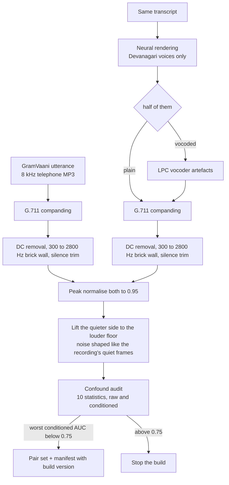
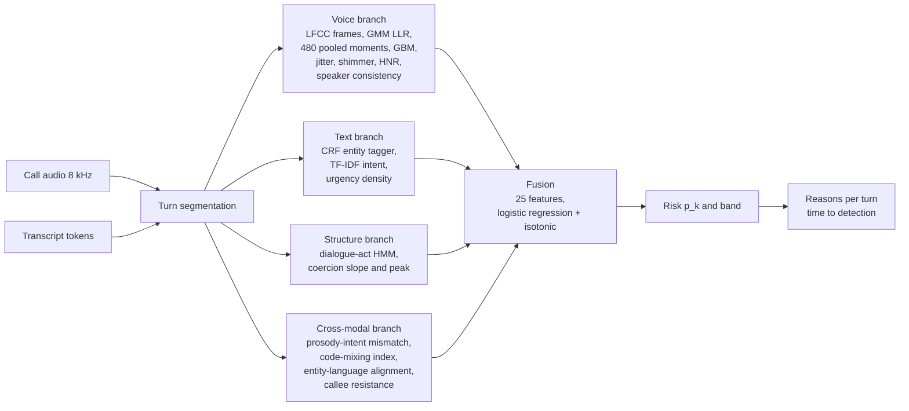
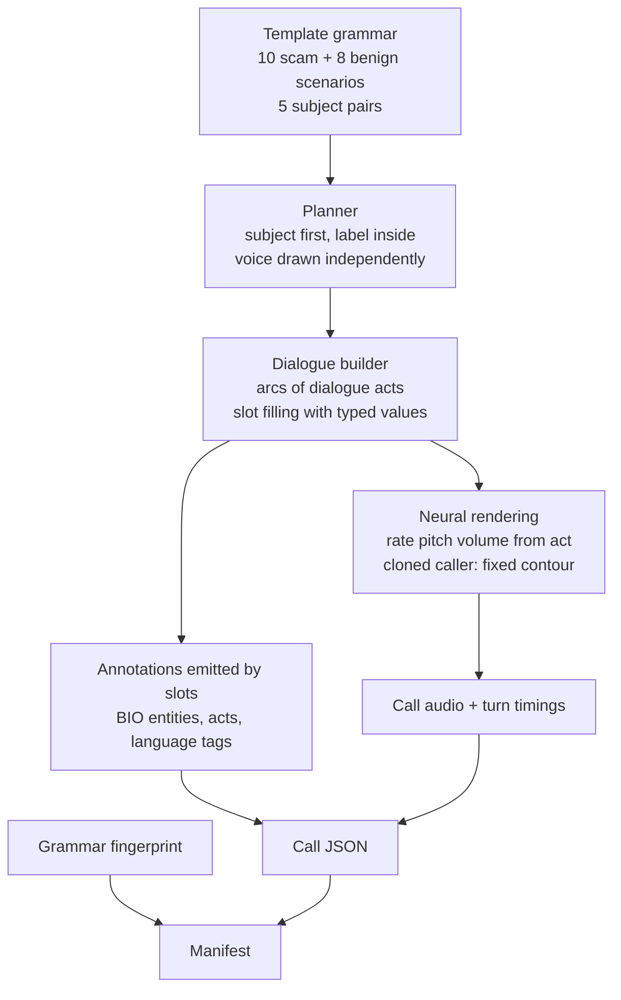
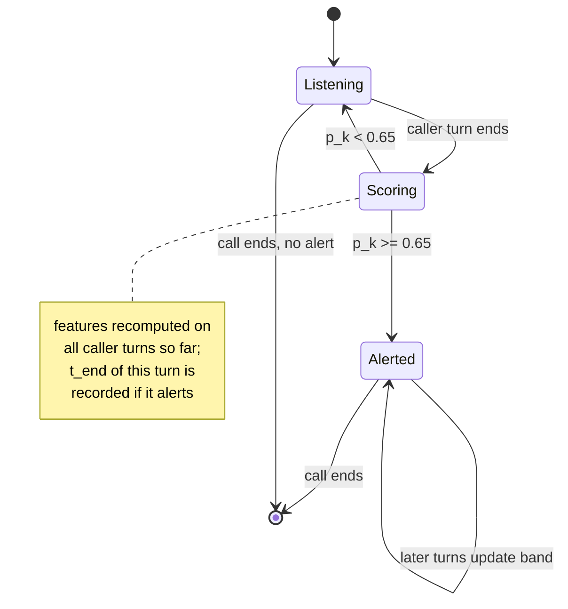
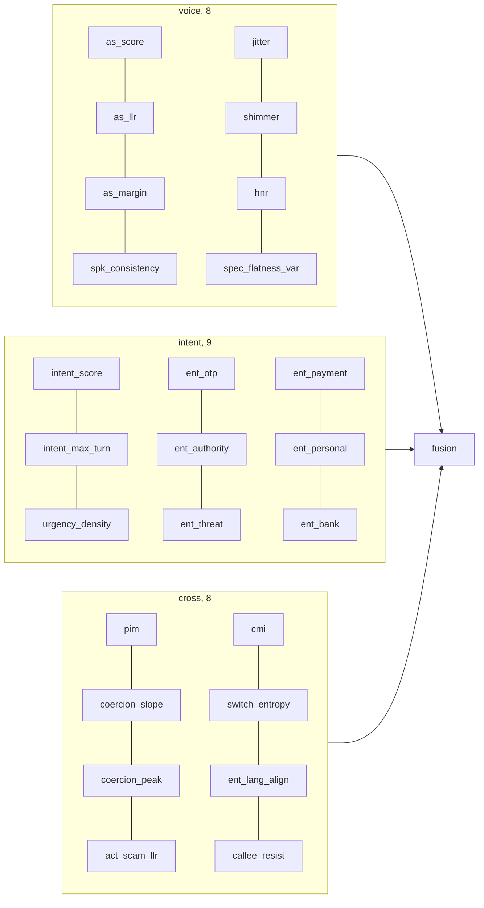

# Detecting Voice-Cloned Fraud Calls in Hinglish by Fusing Anti-Spoofing, Scam-Intent and Prosody-Intent Mismatch Cues

**Project: SwarKavach**

---

## Abstract

Phone fraud in India has moved from hurried scripts read by human callers to calls delivered in cloned voices, and the two defences that exist today each miss half of the problem. Synthetic-speech detectors answer whether a voice is machine-made but say nothing about whether the caller is asking for an OTP; transcript classifiers catch the request but treat a cloned voice and a real one as the same. This project asks whether the two questions can be answered together, on a live call, in the Hindi-English mix in which such calls actually happen. SwarKavach is a four-branch detector. A voice branch scores synthetic speech from cepstral front ends trained on 600 real Hindi field recordings paired with neural renderings of the same transcripts, with the recording channel matched on level, spectral colour and bandwidth so that the detector cannot shortcut on the microphone. A text branch tags seven entity types with a linear-chain CRF and scores scam intent with a calibrated TF-IDF classifier. A structural branch reads the order of dialogue acts as a coercion ramp. A cross-modal branch measures the mismatch between how much pressure the words carry and how flat the delivery is. A calibrated fusion layer, fitted on held-out speakers, turns twenty-five features into a risk band that updates every turn. On a 480-call generated corpus balanced over voice and content, the full system reaches AUC 1.000 with a per-call equal error rate of 0.017 and flags 57 of 60 scam calls at a median of 35.8 seconds, before the sensitive request. On 1,413 real robocall recordings the system was never trained on, in a different language, it recalls 78.7 percent at a 5 percent false-alarm rate. The evidence establishes that transcript content carries most of the decision on scripted data, that a voice branch trained on matched real pairs separates real from cloned Hindi speech, and that the corpus construction, not the classifier, decides whether such results mean anything.

**Keywords:** voice cloning detection, telephone fraud, Hinglish code-mixing, anti-spoofing, dialogue-act coercion, prosody-intent mismatch, calibrated late fusion, time to detection

---

## Contents

1. Introduction
2. Literature Review
3. Preliminary Concepts and Theoretical Background
4. Materials and Methods
5. Proposed Methodology and Implementation
6. Experimental Framework
7. Results and Discussion
8. Conclusion and Future Work

References

## List of Figures

- Figure 1. End-to-end information flow of SwarKavach
- Figure 2. Corpus generation from template grammar to annotated audio
- Figure 3. Construction of the matched anti-spoofing pair set
- Figure 4. Per-turn streaming decision and time-to-detection measurement
- Figure 5. Where each fusion feature comes from

## List of Tables

- Table 1. Critical comparison of recent literature
- Table 2. Hardware and software used
- Table 3. Corpus composition
- Table 4. Performance metrics and where each is used
- Table 5. Ablation of the four arms on the test split
- Table 6. Per-cell accuracy of each arm
- Table 7. Arm comparison on the hard subset
- Table 8. Anti-spoofing equal error rate on real Hindi pairs
- Table 9. Confound audit of the pair set
- Table 10. Out-of-domain recall on real robocalls
- Table 11. Channel robustness
- Table 12. Entity recognition by type
- Table 13. Time to detection

---

# Chapter 1. Introduction

## 1.1 Context

A fraudulent phone call is a small piece of theatre. Someone claims to be from a bank, a courier, the police, or a relative in trouble; a problem is announced; a deadline is attached; the listener is told not to consult anyone; and then, only then, the caller asks for a one-time password, a card number, or a transfer. Indian regulators and banks have published this pattern for years, and it is well enough known that many people can recite it. It still works, because the call is engineered to remove the time in which someone would recall what they know.

Two things have changed recently. The first is scale: automated dialling means the same script reaches thousands of numbers a day, so even a low success rate is profitable. The second is the voice. Neural text-to-speech systems now produce Hindi speech that a listener on a phone line, with its 300 to 3400 hertz band and codec compression, cannot reliably tell from a person. A caller no longer has to be a fluent speaker of the target's language, or to sound calm under questioning, or even to be present. The script can be delivered by a machine that never hesitates.

## 1.2 The specific problem

The calls this project is concerned with have three properties that together make them hard to detect with what exists.

They are conversational. The fraud is not in any one sentence but in a sequence: the request for an OTP is only suspicious because of the threat that preceded it and the instruction not to hang up that follows.

They are code-mixed. A real Indian fraud call is not in Hindi or in English but in both, switching inside a sentence: *"Aapka account block ho jayega, OTP bata dijiye."* Tokenisers, lexicons and named-entity taggers built for one language mishandle the other half.

They may be delivered in a cloned voice. Whether the voice is real changes what the same words mean. A bank reminder read by a machine is a routine outbound campaign; a request for a card PIN read by a machine is almost certainly fraud.

## 1.3 Existing approaches and their limits

Three families of defence exist. Caller-side blocklists act before the call and are defeated by number spoofing. Transcript classifiers, increasingly built on large language models, read what was said and can operate during the call, but they are blind to the voice and to the acoustic signs of pressure. Anti-spoofing detectors, developed largely around the ASVspoof benchmarks, decide whether speech was synthesised, but they are trained and evaluated on utterances, not conversations, and the best-known systems degrade sharply when the synthesis system, language or recording channel changes.

None of the three reads the call as a whole. None is evaluated on the condition that matters most: a benign call in a cloned voice, or a scam call in a human one.

## 1.4 Research gap

The gap is not that nobody has built a scam-call detector or an anti-spoofing model. It is that the two are built and evaluated in isolation, that neither is evaluated on code-mixed Hindi-English conversation, and that the evaluation protocols in use let a detector score well for the wrong reason. Two instances of that last point were found in this project and are reported in Chapter 7: a text classifier that reached AUC 1.000 on a generated corpus because the topic of a call gave away its label, and a voice detector that reached an equal error rate of zero because the real and synthetic recordings differed in bandwidth. Both would have passed as results. Closing that evaluation gap is as much a contribution of this work as the detector itself.

## 1.5 Objectives

1. Develop a corpus of Hindi-English fraud and benign calls in which voice authenticity and scam content vary independently, with entity, dialogue-act and language annotations that are exact by construction.
2. Design a detector that fuses a synthetic-voice branch, a transcript-intent branch, a dialogue-structure branch and a cross-modal prosody-intent branch into one calibrated risk score that updates each turn.
3. Quantify what each branch contributes through an ablation over four arms on the same test split, reported per voice-by-content cell and on the subset of calls written to be hard.
4. Evaluate the voice branch on real Hindi recordings paired with synthetic renderings of the same transcripts, with the recording channel audited for shortcuts before any error rate is reported.
5. Validate generalisation on real fraud recordings from outside the training distribution and measure the time at which a call is flagged relative to the sensitive request.

## 1.6 Proposed approach

SwarKavach treats a call as a stream of turns. For each caller turn it extracts cepstral and prosodic features from the audio, tags entities and classifies intent from the transcript, updates a dialogue-act sequence model, and computes a mismatch between the pressure in the words and the arousal in the delivery. Twenty-five features from these four sources enter a logistic-regression fusion layer with isotonic calibration, fitted on speakers that no branch was trained on. The output is a probability mapped to four risk bands, with an alert raised at 0.65.

## 1.7 Contributions

1. A template grammar that generates code-mixed Hindi-English calls with gold entity spans, dialogue acts and per-token language tags emitted by the same slots that produce the text, so the annotation cannot drift from the transcript. Ten scam and eight benign scenarios, five of them paired on the same subject so that topic does not predict label.
2. A prosody-intent mismatch feature that compares lexical pressure with acoustic arousal turn by turn, and a coercion-trajectory feature that reads the slope of dialogue-act pressure across a call.
3. A method for building a matched anti-spoofing pair set from field recordings, with a ten-statistic confound audit run on every build that measures what the detector will see and stops the pipeline when a channel statistic alone separates the classes.
4. An ablation over audio-only, text-only, late-fusion and full arms, reported per cell and on a hard subset, together with a bag-of-words leak check that exposes label leakage before any model is trained.
5. Out-of-domain validation on 1,413 real robocall recordings, a per-turn time-to-detection measurement, and a channel-robustness sweep over G.711 and GSM codecs.

## 1.8 Report organisation

Chapter 2 positions the work against six recent studies. Chapter 3 defines the signal-processing and statistical concepts the method rests on. Chapter 4 documents materials and the end-to-end procedure. Chapter 5 presents the architecture module by module with pseudocode. Chapter 6 sets out the research questions, datasets, splits and metrics. Chapter 7 reports and interprets the results, including the two evaluation failures that were found and fixed. Chapter 8 concludes.

---

# Chapter 2. Literature Review

## 2.1 Domain and terminology

*Anti-spoofing* or *audio deepfake detection* is the task of deciding whether an utterance was produced by a human larynx or by a synthesis or conversion system. The community's standard metric is the equal error rate (EER), the operating point at which the false-acceptance and false-rejection rates coincide, together with a detection cost function (DCF) that weights the two errors by their operational cost. *Scam-call detection* is the task of deciding, from the words and sometimes the audio of a call, whether the caller intends fraud. The two literatures rarely cite each other.

## 2.2 Benchmarks and the generalisation problem

The ASVspoof challenge series defines how anti-spoofing is evaluated. Its fifth edition (Wang et al., 2024) departs from earlier rounds in three ways that matter here: the bona fide speech is crowdsourced from a large number of speakers in uncontrolled acoustic conditions rather than read in a studio; the attacks are likewise crowdsourced and include adversarial perturbations aimed at the detectors themselves; and the metrics now cover spoofing-robust speaker verification as well as stand-alone detection. The design responds to a finding that recurs across the field: detectors that reach near-zero EER on one round of the benchmark degrade badly on the next, because they learn the artefacts of particular synthesisers and particular recording conditions rather than anything general about synthetic speech.

Yi et al. (2023) survey that failure in detail. Their unified comparison of feature front ends and classifiers across ASVspoof 2021, ADD 2023 and the In-the-Wild set shows the same pattern in every pairing: high in-domain accuracy and a large drop out of domain. Two points from their taxonomy shape this project. Hand-crafted cepstral front ends (LFCC, CQCC, MFCC) remain competitive with learned representations when the test channel differs from training, which argues for keeping classical features in a system that will meet telephone audio. And they note that the datasets in use are overwhelmingly English and Chinese.

## 2.3 Low-resource and Indian languages

That language gap is what IndicSynth addresses (Sharma, Ekbote and Gupta, 2025). The dataset provides about 4,000 hours of synthetic speech from 989 target speakers across twelve Indian languages, including Hindi, with both a mimicry subset, where a target speaker's voice is cloned, and a diversity subset. It was recognised with an outstanding paper award at ACL 2025. Its relevance here is twofold: it establishes that Hindi voice cloning is now a solved generation problem at scale, and it provides a resource that a future version of this project's voice branch should be trained against. What it does not contain is conversation. Every sample is an utterance, and the detection task it supports is utterance-level.

## 2.4 Cross-modal cues: content against delivery

Most detectors read the acoustic signal alone. SLIM (Zhu et al., 2024) is the clearest recent statement of an alternative. The authors observe that in real speech the *style* of delivery and the *linguistic content* are dependent on each other, because the same person chose both, and that this dependency is broken in synthetic speech, where the content is given and the style is imposed by a model. They pretrain a representation of that style-linguistics dependency on real speech only, then use its mismatch as a feature alongside conventional acoustic embeddings. The result is better out-of-domain detection than the acoustic features alone, and a score that can be explained in terms of a measurable quantity.

The prosody-intent mismatch feature in this project is the same intuition applied to a different pair of quantities. SLIM measures whether style fits content in general. SwarKavach asks a narrower, task-specific question: does the amount of pressure in the words match the amount of arousal in the voice? A scripted fraud call read flatly by a machine is high on the first and low on the second. The two approaches differ in what they need: SLIM needs a self-supervised encoder and large real corpora; the feature here needs a fraud lexicon, a pitch tracker and a syllable-level energy measure, and runs on a laptop CPU.

## 2.5 Reading the conversation

On the transcript side, Shen et al. (2025) frame the problem exactly as this project does: existing defences act before the call or after it, and the call itself is unprotected. They model a scam as a sequence of utterances, have a large language model classify each new utterance as fraudulent, safe or uncertain, and warn the user during the call. Their user study is where the title comes from. Two limitations are stated by the authors and matter here. The detector reads text only, so a cloned voice reading a benign script and a human reading it are identical to it. And the latency and cost of an LLM call per utterance constrain deployment on a phone.

TeleAntiFraud-28k (Ma et al., 2025) is the first open audio-and-text resource for telecom fraud. Its 28,511 speech-text pairs are built by transcribing real call recordings, regenerating the audio with text-to-speech to preserve privacy, expanding scenario coverage with LLM self-instruction, and simulating new tactics with multi-agent adversarial generation. It is annotated for fraud reasoning and supports scenario classification, fraud detection and fraud-type classification. Two aspects are directly relevant. The audio is regenerated by TTS for every sample, so the dataset cannot be used to learn whether a voice is real, only what is said. And the language is Chinese; no code-mixed Indian-language equivalent exists.

## 2.6 Critical comparison

**Table 1.** Critical comparison of recent literature. Values are as reported in the cited sources; where a source reports a protocol rather than a single number, the protocol is given.

| Study | Method | Data | Key metric or setting | Main strength | Important limitation |
|---|---|---|---|---|---|
| Wang et al. (2024), ASVspoof 5 | Benchmark; crowdsourced bona fide and spoofed speech, adversarial attacks | Crowdsourced multi-speaker English, many TTS and VC systems | EER and minDCF, plus SASV metrics | Uncontrolled conditions and adversarial attacks at scale | Utterance level; English; no conversational context |
| Yi et al. (2023), survey | Unified comparison of front ends and classifiers | ASVspoof 2021, ADD 2023, In-the-Wild | Cross-dataset EER comparison | Isolates the in-domain to out-of-domain drop across feature families | Descriptive; datasets almost entirely English and Chinese |
| Sharma et al. (2025), IndicSynth | Large-scale synthetic speech generation for detection research | 4,000 h, 989 speakers, 12 Indian languages incl. Hindi | Mimicry and diversity subsets for anti-spoofing | First Hindi-scale cloning resource | Utterances only; no fraud content; no channel matching to field audio |
| Zhu et al. (2024), SLIM | Self-supervised style-linguistics dependency, mismatch as feature | In-domain and out-of-domain deepfake sets | Out-of-domain gain with frozen encoders | Explainable cross-modal cue; better generalisation | Needs large real-speech pretraining; not task-specific |
| Shen et al. (2025) | LLM classifies each utterance during the call | Scam conversations; user study | Per-utterance fraudulent / safe / uncertain | Real-time warning; frames the in-call gap | Text only; per-utterance LLM cost; no voice signal |
| Ma et al. (2025), TeleAntiFraud-28k | Audio-text dataset with reasoning annotations | 28,511 pairs, Chinese, TTS-regenerated audio | Three tasks: scenario, fraud, fraud type | First open audio-text fraud resource | Audio regenerated, so voice authenticity is not learnable; not Indian languages |

## 2.7 Recurring limitations and the position of this work

Three limitations recur. Anti-spoofing work is evaluated on utterances, so a detector never sees the conversational context that would tell it whether a synthetic voice matters. Scam-detection work is evaluated on text, so it never sees the voice. And in both, the reported numbers are only as good as the construction of the evaluation set, a point the ASVspoof organisers make repeatedly and one that this project ran into twice.

SwarKavach sits at the intersection. It reads the voice, the words, the structure and their mismatch on the same call; it does so in Hindi-English code-mix; and it treats the construction and auditing of its own evaluation data as part of the method.

---

# Chapter 3. Preliminary Concepts and Theoretical Background

This chapter defines the quantities the later chapters use. Each is introduced where it is first needed and the reasons for including it are given in one line.

## 3.1 Cepstral front ends

All voice-branch classifiers read cepstral coefficients: a compact description of the short-time spectral envelope. The signal is split into frames of 25 ms with a 10 ms hop and a Hamming window, and pre-emphasised with coefficient 0.97. For each frame the magnitude spectrum is passed through a bank of 40 triangular filters between 300 and 2800 Hz, log-compressed, and decorrelated with a discrete cosine transform:

$$c_n = \sum_{m=1}^{M} \log(E_m) \cos\left[\frac{\pi n}{M}\left(m - \tfrac{1}{2}\right)\right], \quad n = 0, \ldots, N-1$$ (1)

where $E_m$ is the energy in filter $m$, $M = 40$ is the number of filters and $N = 20$ coefficients are kept. Five front ends differ only in the filterbank: linear (LFCC), mel (MFCC), gammatone (GFCC), constant-Q (CQCC) and linear prediction (LPCC). First and second temporal differences are appended and cepstral mean and variance normalisation (CMVN) is applied per utterance, which removes the additive effect of a fixed channel in the cepstral domain. The band limits are set to the band the real recordings actually occupy; the reason is given in Section 7.6.

## 3.2 Gaussian mixture likelihood ratio

The classical anti-spoofing back end fits one Gaussian mixture model (GMM) to bona fide frames and one to spoofed frames, and scores an utterance by the mean log-likelihood ratio over its frames:

$$\text{LLR}(X) = \frac{1}{T}\sum_{t=1}^{T}\left[\log p(x_t \mid \lambda_{\text{spoof}}) - \log p(x_t \mid \lambda_{\text{bona}})\right]$$ (2)

where $X = \{x_1, \ldots, x_T\}$ are the frame vectors and $\lambda$ are the mixture parameters. Up to 64 components are used, chosen from the training-set size. The LLR is one of the fusion features. A gradient-boosted classifier over 480 utterance-level moment statistics of the same frames provides a second, more flexible score.

## 3.3 Prosodic measures

Four scalar measures describe how a turn was delivered. Pitch coefficient of variation $f0_{cv} = \sigma_{f0} / \mu_{f0}$ and pitch span $f0_{span} = (\max f0 - \min f0)/\mu_{f0}$ describe intonation. Emphasis variance is the variance of syllable-peak levels in dB, which captures whether some syllables are hit harder than others. Rate variation is the standard deviation of the syllable rate across the turn. Each is mapped to the unit interval with anchors at the 10th and 90th percentiles of the corpus, and combined with weights 0.34, 0.24, 0.26 and 0.16 into an acoustic arousal score $a \in [0, 1]$. Frame-level energy variance was tried first for emphasis and rejected: it is dominated by vowel-consonant alternation and pointed the wrong way.

## 3.4 Prosody-intent mismatch

A lexical arousal score $\ell \in [0, 1]$ per caller turn is built from the fraud lexicon and the intent model. Over the $n$ caller turns of a call the mismatch is

$$\text{PIM} = 0.65 \cdot \frac{\sum_i w_i \max(0, \ell_i - a_i)}{\sum_i w_i} + 0.35 \cdot \frac{1 - \rho(\ell, a)}{2} \cdot \max_i \ell_i$$ (3)

where $w_i$ weights turns by their lexical pressure and $\rho$ is the Pearson correlation between the two sequences. The first term rewards turns where the words press and the voice does not; the second rewards a delivery that does not track the content at all, gated by the peak pressure so that a call with no coercive language cannot score on correlation noise. The output is clipped to $[0, 1]$.

## 3.5 Coercion trajectory

Each dialogue act carries a coercion rank in $[0, 1]$: greeting 0.0, identification 0.1, problem statement 0.35, authority claim 0.55, threat 0.8, deadline 0.85, isolation 0.9, request for sensitive information 0.95, pressure escalation 1.0. The coercion slope is the least-squares slope of rank against caller-turn index; the peak is its maximum. A scripted fraud call climbs; a bank reminder stays flat. The slope is what separates a call that *built* pressure from one that merely mentioned a deadline.

## 3.6 Code-mixing index

Each token carries a language tag (Hindi, English or universal). The code-mixing index of a call is

$$\text{CMI} = 1 - \frac{\max_L n_L}{n - u}$$ (4)

where $n_L$ is the token count in language $L$, $n$ the total and $u$ the number of language-independent tokens. Switch entropy and the fraction of entity tokens whose language matches their surrounding turn complete the language features.

## 3.7 Classification metrics

For a binary decision at threshold $\tau$, with true positives $TP$, false positives $FP$, false negatives $FN$ and true negatives $TN$:

$$\text{Precision} = \frac{TP}{TP + FP}, \qquad \text{Recall} = \frac{TP}{TP + FN}, \qquad F_1 = \frac{2 \cdot \text{Precision} \cdot \text{Recall}}{\text{Precision} + \text{Recall}}$$ (5)

The area under the ROC curve (AUC) is the probability that a randomly chosen scam call scores above a randomly chosen benign call, and is threshold-free. The equal error rate is the value at which the false-positive rate equals the false-negative rate. Two calibration measures are reported: the Brier score, the mean squared difference between predicted probability and the 0/1 label, and the expected calibration error (ECE), the average over probability bins of the gap between mean predicted and observed positive rate.

## 3.8 Time to detection

For a scam call flagged at turn $k$, time to detection is $t_{\text{end}}(k)$, the end time of the first caller turn at which the fused risk crosses the alert threshold of 0.65. It is reported in seconds and in turns, against the time of the first sensitive request.

---

# Chapter 4. Materials and Methods

## 4.1 Materials

**Table 2.** Hardware and software used.

| Item | Specification |
|---|---|
| Training and evaluation machine | Google Colab CPU runtime, Python 3.13, no GPU used |
| Console and development machine | Laptop, Windows 11 Home 10.0.22631, 7.9 GB RAM, Python 3.11.9 |
| Numerical stack | NumPy 2.4.3, SciPy 1.17.1, scikit-learn 1.9.0 (console), PyTorch 2.11.0 CPU |
| Speech synthesis | edge-tts 7.2.8 (Microsoft neural voices hi-IN-MadhurNeural, hi-IN-SwaraNeural, en-IN-PrabhatNeural, en-IN-NeerjaNeural, en-IN-NeerjaExpressiveNeural) |
| Codec simulation | FFmpeg for GSM 06.10; G.711 mu-law and A-law implemented in NumPy |
| Real Hindi speech | GramVaani Hindi ASR corpus, dev and eval partitions (8 kHz telephone MP3) |
| Real fraud recordings | Robocall audio dataset, 1,413 recordings with transcripts (1,378 English, 35 Chinese) |
| Web console | Flask server, static JavaScript front end |
| Version control and orchestration | Git; a runner module that checkpoints each stage to Google Drive and rebuilds only what its inputs changed |

All audio is processed at 8 kHz, the telephone rate, after resampling. No ASR system was installed in the reported run; the transcript branch operates on the reference transcript, and Section 7.9 states the consequence.

## 4.2 Methodological procedure

**Step 1. Corpus generation.** A template grammar produces 480 calls. Each call is planned first (subject, label, voice, speaker, split) and only then rendered, so that the four cells of voice-by-content are balanced by construction. Every entity mention, dialogue act and language tag is emitted by the template slot that produced the token, so the annotation is exact rather than annotated after the fact. Speakers are assigned to train, dev and test before calls are assigned to speakers, which makes the splits speaker-disjoint.

**Step 2. Audio rendering.** Each turn is synthesised with a neural voice whose rate, pitch and volume are set from the turn's dialogue act. A call labelled as cloned has its caller turns rendered with a fixed contour regardless of act; a human-labelled caller modulates. Callee turns always modulate.

**Step 3. Anti-spoofing pair construction.** 600 real GramVaani utterances are paired with neural renderings of their own transcripts. Half the renderings are also passed through a vocoder, so the spoof side is not one system. Both members of each pair are put through the same channel: G.711 companding, DC removal, a brick-wall band-pass to 300 to 2800 Hz, silence trimming, peak normalisation, and noise matching in which the quieter side is lifted to the louder side's floor with noise shaped like the recording's own quiet-frame spectrum.

**Step 4. Confound audit.** Before the pair set is accepted, ten scalar statistics are computed per clip, on the raw file and after the same conditioning the detector applies, and the AUC of each statistic alone is reported. The build stops if any conditioned statistic exceeds 0.75.



**Figure 3.** Construction of the matched anti-spoofing pair set. Both sides go down the same channel before the noise floors are measured, and the audit decides on what the detector will see.

**Step 5. Feature extraction.** For every call: cepstral frame features for the GMM, 480 pooled moments for the boosted classifier, four prosodic measures per caller turn, TF-IDF representations of each turn, CRF entity tags, dialogue-act sequence likelihoods, language tags and the derived cross-modal quantities.

**Step 6. Training.** The CRF, intent and act models are fitted on the train split. Prosody anchors are recalibrated on train audio. The anti-spoofing models are fitted on the train partition of the real pair set, never on the generated corpus, because both cells of the corpus are machine voices. The fusion layer and every ablation arm are fitted on the dev split, so that the fusion never sees in-sample branch outputs.

**Step 7. Evaluation.** All reported numbers come from the test split or from data outside the training distribution: the real pair test partition, the robocall recordings, and codec-degraded copies of the test audio.

---

# Chapter 5. Proposed Methodology and Implementation

## 5.1 Problem formulation

Input: a call $C = \{(s_j, x_j, w_j)\}_{j=1}^{J}$ of $J$ turns, where $s_j \in \{\text{caller}, \text{callee}\}$, $x_j$ is the turn's audio and $w_j$ its transcript tokens. Output, after each caller turn $k$: a risk probability $p_k \in [0, 1]$, a band in {low, elevated, high, critical} with edges at 0.35, 0.65 and 0.85, the entity spans found so far, and a list of reasons attributing the score to its branches. The call-level decision is $p_J \ge 0.65$.

## 5.2 Overall architecture



**Figure 1.** End-to-end information flow of SwarKavach. Every branch consumes the same turn segmentation; the fusion layer sees only the twenty-five named features and is fitted on speakers the branches were not trained on.

## 5.3 Module 1: corpus generation



**Figure 2.** Corpus generation from template grammar to annotated audio.

*Input.* A scenario (for example `kyc_freeze` or `bank_reminder`), a style (hard scam, mild scam, or benign), a voice label and a speaker id.

*Processing.* An arc is a sequence of dialogue acts, for instance `GREET CONFIRM IDENTIFY_SELF PROBLEM_STATE AUTHORITY_ASSERT DEADLINE INSTRUCT REQUEST_SENSITIVE VICTIM_COMPLY CLOSE`. For each act a template is drawn from the scenario's own pool, then from style pools, and always from a neutral pool shared by both classes. Templates contain typed slots such as `{BANK}`, `{OTP_WORD}`, `{DEADLINE}`; each slot resolves to a surface string and an entity type at once, so the tokens it contributes receive the corresponding BIO tags and nothing else in the turn is touched. Literal entity mentions outside slots are forbidden and checked by a validator.

*Parameters.* 480 calls, 24 speakers, split 50/25/25 by speaker, scam ratio 0.5, synthetic-voice ratio 0.5 drawn independently, 22 percent of scams in the mild style, 25 percent of calls from scenarios that have no counterpart on the other side of the label.

*Why.* Two design rules are the result of the leak analysis in Section 7.2. Five subjects (a parcel, a bank KYC call, a bank transaction call, a relative in trouble, a financial offer) each have a scam and a benign scenario that share their setup lines and differ only in what is asked for. And greetings, closings, acknowledgements and polite instructions come from one pool used by both classes. Without both, the subject or the phrasing gave the label away.

*Output.* One JSON per call with turns, tokens, BIO tags, acts, language tags, timings, and a manifest carrying a fingerprint of the grammar, so that a corpus generated from older templates is never silently reused.

## 5.4 Module 2: voice branch

*Input.* The caller's audio, concatenated over caller turns.

*Processing.* Every cepstral computation is preceded by one conditioning function: remove DC, apply a Kaiser-windowed FIR band-pass from 300 to 2800 Hz with a 100 Hz transition and 60 dB stop-band attenuation run forwards and backwards, trim leading and trailing silence more than 40 dB below the loudest frame, and add dither at 70 dB below the signal so that an exact zero in a stop band cannot be told from a near-zero. The conditioned signal is RMS-normalised, framed, and passed to the front ends of Section 3.1. Voiced frames are selected by an energy-based activity detector. The GMM score is the mean LLR of Equation 2; the boosted classifier reads 480 pooled statistics (mean, standard deviation, skew and kurtosis of each coefficient and its deltas). Jitter, shimmer and harmonic-to-noise ratio are computed on the raw signal. Speaker-embedding consistency measures whether the caller's turns come from one voice.

*Parameters.* Front end LFCC by default; 40 filters, 20 coefficients, deltas, CMVN. GMM up to 64 components, 120 EM iterations. Boosted classifier: histogram gradient boosting, 220 iterations, learning rate 0.07, depth 4.

*Why.* The band and the trimming are there because the real recordings are 8 kHz telephone MP3 whose encoder low-passes just under 3 kHz, while neural renderings arrive at 24 kHz. Section 7.6 reports what happened without them.

*Output.* Eight fusion features: synthetic-voice score, LLR, detector margin, speaker consistency, jitter, shimmer, HNR, spectral-flatness variance.

## 5.5 Module 3: text branch

*Input.* Transcript tokens of each turn.

*Processing.* A linear-chain conditional random field, implemented in this project, tags seven entity types in BIO form: OTP, bank entity, authority claim, threat or deadline, payment handle, personal-information request, money amount. Features are the token, its shape, prefixes and suffixes, the neighbouring tokens and the language tag. L2 regularisation 0.5, 200 iterations. A TF-IDF representation over word unigrams and bigrams plus character 3 to 5 grams inside word boundaries feeds a class-balanced logistic regression with C = 4.0; its per-turn probabilities are pooled to a call score as 0.6 times the maximum plus 0.4 times the mean. A rule baseline over the fraud lexicon is kept for comparison.

*Why.* Character n-grams are what make the classifier survive romanised Hindi spelling variation (*bataiye*, *batayiye*, *bta dijiye*). The CRF is a project implementation rather than a library because the tagger must run inside the per-turn latency budget on a CPU and its features had to include the language tag.

*Output.* Nine fusion features: intent score, peak turn intent, urgency-word density, and six entity densities.

## 5.6 Module 4: structure and cross-modal branch

*Input.* The dialogue-act sequence of caller turns, their coercion ranks, the per-turn lexical and acoustic arousal, and the token language tags.

*Processing.* A hidden Markov model over acts is fitted separately on scam and benign calls; the log-likelihood ratio of the observed sequence is a feature. Coercion slope and peak follow Section 3.5. The prosody-intent mismatch follows Equation 3. CMI, switch entropy and entity-language alignment follow Section 3.6. Callee resistance is the fraction of callee turns tagged as resisting.

*Why.* Word-level models ask what was said; this module asks in what order and in what voice. The order is where a script gives itself away, and the mismatch is where a machine reading a script does.

*Output.* Eight fusion features.

## 5.7 Module 5: fusion and streaming decision



**Figure 4.** Per-turn streaming decision and time-to-detection measurement. Time to detection is the end time of the first caller turn whose fused risk reaches 0.65.

*Input.* The 25-dimensional feature vector after each caller turn.

*Processing.* A logistic regression with C = 0.7 and balanced class weights, wrapped in isotonic calibration, produces $p_k$. Bands follow Section 5.1. Reasons are generated per turn from the sign and magnitude of each branch's contribution.

*Why fitted on dev.* The fusion stacks on top of branch outputs. Fitting it on rows the branches trained on would feed it in-sample predictions that never occur at test time. The ablation arms in Chapter 7 are fitted the same way, on the same 120 dev calls.



**Figure 5.** Where each fusion feature comes from. The four ablation arms of Chapter 7 are subsets of these groups.

## 5.8 Algorithm

```
Algorithm 1: Streaming risk for one call
Input:  turns (s_j, x_j, w_j), j = 1..J; alert threshold tau = 0.65
Output: p_k for each caller turn k; alert time t_alert or none

1  caller <- []; t_alert <- none
2  for j in 1..J:
3      if s_j != caller: continue
4      append (x_j, w_j) to caller
5      # voice
6      y <- condition(concat audio of caller)          # DC, band-pass, trim, dither
7      as_score, as_llr, as_margin <- antispoof(y)
8      spk_consistency, jitter, shimmer, hnr, flatness_var <- voice_stats(caller)
9      # text
10     bio_j <- CRF.tag(w_j); intent_j <- TFIDF.score(w_j)
11     intent_score <- 0.6 * max_i intent_i + 0.4 * mean_i intent_i
12     entity densities <- counts of BIO spans by type / turns so far
13     # structure and cross-modal
14     acts <- ActHMM.decode(caller); act_scam_llr <- log p(acts|scam) - log p(acts|benign)
15     slope, peak <- coercion_trajectory(acts)
16     ell_i <- lexical_arousal(w_i); a_i <- acoustic_arousal(x_i) for i in caller
17     pim <- Equation 3 over (ell, a)
18     cmi, switch_entropy, ent_lang_align <- language_features(caller)
19     callee_resist <- resisting callee turns / callee turns so far
20     # fusion
21     f <- [voice(8), intent(9), cross(8)]
22     p_k <- calibrate(sigmoid(w . f + b))
23     if p_k >= tau and t_alert is none: t_alert <- t_end(j)
24     emit p_k, band(p_k), reasons(f)
25 return p_K, t_alert
```

The pseudocode corresponds to the implementation in `fusion/streaming.py`, `fusion/featurize.py` and `fusion/model.py`; feature order is that of `schema.FUSION_FEATURES`.

## 5.9 Implementation details

- Language and libraries: Python; NumPy and SciPy for signal processing; scikit-learn for logistic regression, isotonic calibration, GMM and histogram gradient boosting; PyTorch is present for an optional RawNet-style back end that was not used in the reported run. The CRF, cepstral front ends, pitch tracker, syllable segmenter and dialogue-act HMM are project code.
- Framing: 25 ms window, 10 ms hop, Hamming, 512-point FFT, pre-emphasis 0.97, 8 kHz.
- Filterbank: 40 filters, 300 to 2800 Hz, 20 coefficients, lifter 22, energy coefficient kept, deltas of width 2, CMVN.
- Voice back end: GMM up to 64 components; boosting 220 iterations at rate 0.07, depth 4; the auto backend prefers the boosted classifier when present.
- Text: TF-IDF word (1,2) and char_wb (3,5), sublinear TF; logistic regression C = 4.0, balanced, 3,000 iterations. CRF L2 = 0.5, 200 iterations.
- Fusion: logistic regression C = 0.7, balanced, 4,000 iterations, isotonic calibration with cross-validation folds chosen so that each has at least 60 rows; fitted on 120 dev calls.
- Thresholds: alert at 0.65; bands at 0.35, 0.65, 0.85.
- Prosody anchors: 10th and 90th percentile of pooled train audio, recalibrated on every training run, with a direction report that flags any component whose synthetic median exceeds its human median by more than 5 percent of the anchor span.
- Runtime on the laptop CPU, measured in the console: 1.7 s for a 45 s call with the text branches only, and 18.8 s for a 74 s call with all four branches, of which the voice branch takes 3.5 s and the cross-modal branch 1.1 s; the remainder is the per-turn streaming pass, which recomputes over all caller audio at every turn. The console streams reasons per turn.
- Reproducibility: seed 20230100 throughout; the corpus manifest records the grammar fingerprint and every generation parameter; the pair manifest records a build version and the audit; the runner refuses to reuse a corpus or pair set whose fingerprint or version differs from the checked-out code, and rebuilds the stages that depend on it.

---

# Chapter 6. Experimental Framework

## 6.1 Research questions

- **RQ1.** Does fusing the four branches improve on the best single branch, and on late fusion of branch scores?
- **RQ2.** Which cells of the voice-by-content grid does each arm get wrong?
- **RQ3.** On the calls written to be hard, lexically mild scams and benign calls that sound like scams, does anything beyond text help?
- **RQ4.** Can the voice branch separate real Hindi speech from cloned Hindi speech when the recording channel is matched?
- **RQ5.** Does the text branch generalise to real fraud recordings from another language and distribution?
- **RQ6.** How early in a call is a scam flagged, and does telephone codec degradation change the decision?

## 6.2 Datasets

**Table 3.** Corpus composition.

| Item | Generated Hinglish corpus | Real Hindi pair set | Real robocall set |
|---|---|---|---|
| Source | Template grammar of this project, rendered with Microsoft neural voices | GramVaani Hindi ASR corpus, dev and eval, paired with edge-tts renderings | Robocall audio dataset with transcripts |
| Samples | 480 calls, 5,093 turns, 7.3 h of audio, 1,289 entity spans | 600 pairs, 1,200 clips, mean 9.3 s | 1,413 recordings |
| Classes | 240 scam, 240 benign; 240 cloned, 240 human; 120 per cell | 600 bona fide, 600 spoof (half plain TTS, half vocoded) | 1,413 fraud; 60 project benign calls as controls |
| Acquisition | 8 kHz after resampling; 18 scenarios; 24 speakers; mean 54.6 s per call | 8 kHz telephone MP3 field recordings; renderings at 24 kHz, downsampled | Field recordings, English and Chinese |
| Labels | Exact by construction from template slots; 7 entity types; 18 dialogue acts; per-token language | Bona fide vs spoof by construction | Fraud by provenance; no benign half exists |
| Splits | Train 240 / dev 120 / test 120, speaker-disjoint, 12 / 6 / 6 speakers | Train 890 / test 310 clips, speaker-disjoint on the bona fide side, pairs kept together | All used for testing only |
| Imbalance | None; balanced by the planner | None | Positive-only; negatives are project benign calls |
| Augmentation | Codec degradation at evaluation only (G.711u, G.711a, GSM) | Channel matching at build (Section 4.2); codec at evaluation | None |
| Exclusions | None | Lines outside 0.5 s or with rendering failure; the reported build lost none of 600 | Recordings without a transcript |

Entity spans by type: bank entity 364, threat or deadline 345, OTP 172, payment handle 106, money amount 105, authority claim 103, personal-information request 94. Hard negatives, benign calls written to sound like their scam counterpart, number 164; lexically mild scams number 52. Code-mixing index is 0.218 for scam calls and 0.201 for benign, so the language mix does not separate the classes on its own.

## 6.3 Baselines and arms

Four arms are fitted on the same 120 dev calls and scored on the same 120 test calls: audio-only (the eight voice features), text-only (the nine intent features), late fusion (one calibrated score per branch, then a logistic layer), and full (all twenty-five features). A rule baseline over the fraud lexicon is reported for intent. For the voice branch, five front ends by two back ends are compared on the real pair set. All baselines are project implementations run under the same protocol.

## 6.4 Metrics

**Table 4.** Performance metrics and where each is used.

| Task | Metrics | Reporting point |
|---|---|---|
| Call classification | AUC, F1, accuracy, EER at the call level; per-cell accuracy; precision and recall at 0.65 | Reported per cell because the aggregate hides the cells that matter |
| Anti-spoofing | EER per front end, back end and codec; minimum t-DCF; confound audit AUC per statistic | Read next to the audit; an EER is only as good as the channel match |
| Entity recognition | Precision, recall, F1 with exact span matching, per type | Gold transcripts; the ASR row is absent and the reason stated |
| Intent | AUC, F1, confusion at 0.65 | Rule baseline against TF-IDF |
| Calibration | Brier score, ECE | Test split |
| Generalisation | Recall at 0.65 and cross-domain AUC on robocalls; false-alarm rate on project benign calls | Upper bound; no benign half exists in the source |
| Time to detection | Median, p90, turns to alert; per scenario | Threshold 0.65 |
| Robustness | AUC of full and audio-only arms under each codec | Real codec flag recorded per condition |
| Deployment | Per-call latency by branch on the laptop CPU | Measured in the console |

## 6.5 Protocol against leakage

Two checks run before any model. A pure-Python bag-of-words classifier is trained and tested across speaker folds on the caller text alone; if it reaches AUC above about 0.99 the corpus is separable on authorship and the grammar is revised. And the confound audit of Step 4 runs on every pair build. Both checks changed this project's design; Section 7.2 and Section 7.6 report how.

---

# Chapter 7. Results and Discussion

## 7.1 Primary result

**Table 5.** Ablation of the four arms on the test split (120 calls, fitted on dev).

| Arm | Voice | Intent | Cross | AUC | F1 | Accuracy | EER |
|---|---|---|---|---|---|---|---|
| Audio only | Yes | No | No | 0.616 | 0.187 | 0.492 | 0.400 |
| Text only | No | Yes | No | 0.999 | 0.983 | 0.983 | 0.033 |
| Late fusion | scores | scores | scores | 0.999 | 0.974 | 0.975 | 0.033 |
| Full | Yes | Yes | Yes | 1.000 | 0.983 | 0.983 | 0.017 |

The full arm is the reference. Text alone is within 0.001 AUC of it and the difference in F1 is zero. The audio-only arm is close to chance, and the reason is structural rather than a weakness of the voice branch: the corpus draws the voice label independently of the scam label, so half of the scams are read by human voices and half of the benign calls by cloned ones. A detector that reads only the voice cannot predict the content, and 0.616 is what that looks like. Late fusion is marginally below the full arm, which is expected when the branch scores are already saturated and the fusion has nothing left to combine. The honest reading of Table 5 is that on scripted data the words carry the decision, and Section 7.3 asks whether that is an artefact.

## 7.2 What the corpus gave away, and what was done about it

The first generated corpus produced a text-only AUC of 1.000 on the test split with every word of the fraud lexicon deleted from the transcripts. A classifier that cannot see the words *OTP*, *block*, *verify* or *urgent* and still separates the classes perfectly is reading something other than intent. Two causes were found.

Scenario determined label. Ten scam subjects and eight benign ones with no overlap meant that identifying the subject of a call identified its class. Every topical word was a label word.

The two classes shared no phrasing. The template sampler took the first pool that carried an act, and the benign pool always did, so a benign call never drew a shared greeting and the phrase *thank you for your time* occurred only in benign closings. A review of the templates found 43 tokens that appeared only on the scam side and 30 only on the benign side, most of them politeness forms rather than fraud vocabulary.

The fixes are the design rules of Section 5.3. Their effect was measured with the pure-Python bag-of-words check before any model was retrained: whole-corpus AUC fell from 1.000 to 0.990, and on the hard subset to 0.947. The remainder is not an artefact. A scam call does threaten and does ask for a code, and a bag of words finds that. The point of the exercise was to make sure the remaining separability was the phenomenon and not the authorship.

## 7.3 Per-cell behaviour and the hard subset

**Table 6.** Per-cell accuracy of each arm at threshold 0.65 (30 calls per cell).

| Arm | Human, benign | Human, scam | Cloned, benign | Cloned, scam |
|---|---|---|---|---|
| Audio only | 0.933 | 0.100 | 0.800 | 0.133 |
| Text only | 1.000 | 1.000 | 1.000 | 0.933 |
| Late fusion | 1.000 | 1.000 | 1.000 | 0.900 |
| Full | 1.000 | 1.000 | 1.000 | 0.933 |

The audio-only row is the one to read. It classifies almost every call as benign, which is correct for the two benign cells and wrong for the two scam cells: the branch has no way to distinguish a scam from a benign call, and its 0.933 on human-benign is not skill. Every other arm's errors are in one cell, cloned scam, where text and full miss two calls of thirty and late fusion three.

**Table 7.** Arm comparison on the hard subset: 13 lexically mild scams against 41 benign calls written to sound like scams (54 of the 120 test calls).

| Arm | AUC | F1 | Recall | Precision |
|---|---|---|---|---|
| Audio only | 0.362 | 0.000 | 0.000 | 0.000 |
| Text only | 0.993 | 0.917 | 0.846 | 1.000 |
| Late fusion | 0.993 | 0.917 | 0.846 | 1.000 |
| Full | 0.998 | 0.917 | 0.846 | 1.000 |

This is the only place an arm comparison has room to say anything, and it is where the full arm moves ahead of text: 0.998 against 0.993, with the same F1. The difference is two call orderings out of 533 scam-benign pairs and should not be read as a demonstrated fusion gain. It is a direction. On the previous corpus the full arm was *below* text on this subset (0.989 against 0.998), so the corpus revision moved the comparison the way the design intended.

## 7.4 Intent and entity branches in isolation

The TF-IDF intent model reaches AUC 1.000 and F1 0.976 on the test split with three false positives and no misses, against AUC 0.913 and recall 0.483 for the lexicon rule baseline. The gap is the difference between counting fraud words and learning which combinations of them, in which spellings, mark a request. Three benign calls score above 0.65 on the intent branch alone; the fused system, which also sees the coercion trajectory and the callee's behaviour, clears all three.

**Table 12.** Entity recognition by type, CRF on gold transcripts, exact span match, test split (324 spans).

| Type | Support | Precision | Recall | F1 |
|---|---|---|---|---|
| Bank entity | 90 | 0.989 | 1.000 | 0.995 |
| Threat or deadline | 83 | 0.976 | 0.964 | 0.970 |
| OTP | 45 | 1.000 | 1.000 | 1.000 |
| Payment handle | 29 | 1.000 | 1.000 | 1.000 |
| Money amount | 27 | 1.000 | 1.000 | 1.000 |
| Authority claim | 27 | 0.917 | 0.815 | 0.863 |
| Personal-information request | 23 | 1.000 | 0.739 | 0.850 |
| **All** | **324** | | | **0.970** |

The four types with a fixed surface form (OTP, payment handle, money amount, bank entity) are recognised almost perfectly. The two weakest, authority claims and personal-information requests, are the two whose wording varies most across templates (*RBI se*, *cyber cell se*, *head office se*; *aapka Aadhaar number*, *card ke peeche ka number*), and both lose recall rather than precision: the tagger declines to tag what it has not seen, which is the safer failure for a system that raises alarms.

## 7.5 Calibration

The fused probability is well calibrated on the test split: Brier score 0.011 and ECE 0.015. Fifty-one of the 120 calls fall in the lowest bin with mean predicted probability 0.003 and no scams; fifty-six fall in the highest with mean 0.997 and all scams. Nine calls sit in a bin around 0.11, of which one is a scam, an observed rate of 0.11. The middle bins are thin, which is what a saturated classifier looks like, and the isotonic layer keeps the few calls there honest.

## 7.6 The voice branch on real speech, and what the audit found

**Table 8.** Anti-spoofing equal error rate on the real Hindi pair set, 310 test clips, by front end, back end and codec.

| Front end | GMM clean | GMM G.711u | GMM G.711a | GMM GSM | GBM clean | GBM G.711u | GBM G.711a | GBM GSM |
|---|---|---|---|---|---|---|---|---|
| LFCC | 0.000 | 0.000 | 0.000 | 0.006 | 0.000 | 0.000 | 0.000 | 0.032 |
| GFCC | 0.006 | 0.006 | 0.006 | 0.019 | 0.006 | 0.006 | 0.006 | 0.019 |
| MFCC | 0.006 | 0.006 | 0.006 | 0.000 | 0.000 | 0.000 | 0.000 | 0.026 |
| CQCC | 0.013 | 0.013 | 0.013 | 0.000 | 0.000 | 0.000 | 0.000 | 0.006 |
| LPCC | 0.000 | 0.000 | 0.000 | 0.000 | 0.006 | 0.000 | 0.000 | 0.006 |

These rates are low enough that the first question has to be whether they measure the voice. The first build of this pair set gave 0.000 in 33 of 40 cells, and a code review found three differences between the real recordings and the renderings that the audit of the time did not measure. The recordings are 8 kHz telephone MP3 whose encoder low-passes just under 3 kHz; the renderings were 24 kHz, resampled through a short filter that left energy up to 4 kHz. The share of energy above the band separated the classes at AUC 1.000 on its own, the share below 300 Hz at 0.98, a second of trailing digital silence in the renderings at 0.86, and a DC offset on the vocoded half at 0.93. Every front end read those bands directly. A fourth finding was a bug: the build drew synthetic voices from a pool three fifths of which cannot read Devanagari and returned empty audio, so 600 requested lines had become 211 pairs from two voices.

The conditioning of Section 5.4 and the matching of Section 4.2 are the response. The audit now scores ten statistics on the raw files and after conditioning, and decides on the conditioned table.

**Table 9.** Confound audit of the reported pair set (600 pairs): AUC of each statistic alone, bona fide against spoof.

| Statistic | Raw files | After conditioning |
|---|---|---|
| Noise floor (dB) | 0.508 | 0.510 |
| Dynamic range proxy (dB) | 0.604 | 0.604 |
| Zero-crossing rate | 0.551 | 0.540 |
| Duration | 0.549 | 0.549 |
| Quiet-frame spectral centroid | 0.519 | 0.514 |
| Quiet-frame spectral tilt | 0.553 | 0.548 |
| Energy share above band | 0.629 | 0.519 |
| Energy share below band | 0.723 | 0.704 |
| Trailing quiet (s) | 0.502 | 0.503 |
| DC offset | 0.617 | 0.663 |
| **Worst** | **0.723** | **0.704** |

Noise floor, colour, trailing silence and bandwidth above the band sit near chance after conditioning. Two statistics remain above 0.6. The residual energy below 300 Hz, at 0.70, is measured in a band the filterbank does not read, so it is not available to any cepstral front end here, though it would be to a waveform model. Dynamic range, at 0.60, is a property of the speech rather than the channel: a spontaneous field recording varies in level more than a read rendering does. Both are stated because a reader should know how far a single number gets before any model runs. The audit's own threshold for stopping the build is 0.75; this set passed at 0.704 with a warning.

With the channel matched as far as ten statistics can see, Table 8 still reports near-zero error. The remaining explanation is the spoof side: Microsoft's Hindi catalogue has two voices, so every spoof in the set comes from one of two synthesis systems, both present in training. A detector only has to recognise those two. Benchmarks such as ASVspoof 5 report 1 to 5 percent EER against dozens of unseen systems, and that is the number this branch would have to earn on IndicSynth or a comparable resource before it can be called a general Hindi anti-spoofing result. GSM is the most informative column because it is the only condition where the channel takes away enough detail to cost anything.

## 7.7 Generalisation to real fraud calls

**Table 10.** Out-of-domain recall on 1,413 real robocall recordings, models trained only on the generated Hinglish corpus.

| Model | Recall at 0.65 | Cross-domain AUC | False alarms on 60 benign controls |
|---|---|---|---|
| Lexicon rules | 0.069 | 0.712 | 0.033 |
| TF-IDF intent | **0.787** | **0.946** | **0.050** |

This is the result that the corpus revision changed most. On the corpus before the leak fixes, the same model recalled 0.699 at AUC 0.896 with a 15 percent false-alarm rate. Removing the phrasing and topic shortcuts made the classifier learn something that transfers: recall rose ten points and false alarms fell to a third. The recordings are English monologues from a different country, so the transfer rests on shared vocabulary (*account*, *verify*, *urgent*, *card*, *suspended*) and on the character n-grams. The AUC is an upper bound because no benign half of the robocall set exists and the negatives are this project's own benign calls.

## 7.8 Time to detection and channel robustness

**Table 13.** Time to detection on the 60 test scam calls, alert threshold 0.65.

| Measure | Value |
|---|---|
| Calls flagged | 57 of 60 |
| Median time to alert | 35.8 s |
| 90th percentile | 49.4 s |
| Median turns to alert | 6 |
| Fastest scenario | Digital arrest, 17.4 s |
| Slowest scenario | Lottery prize, 43.8 s |

Before the corpus revision the median was 25.6 s on 59 of 60 calls. The revision gave scam callers neutral openings, small talk and shared greetings, so a scam now takes longer to reveal itself, which is how real calls behave. Six turns is still before the sensitive request in every flagged call. Digital arrest is fastest because its script asserts authority and threatens in its first caller turns; lottery and fake-relative scripts spend longer on setup. The three calls that are never flagged do not cross 0.65 at any turn; at the call level the hard subset shows the same pattern, with 11 of 13 lexically mild scams caught.

**Table 11.** Channel robustness: AUC of two arms on the test split under each codec.

| Condition | Full arm | Audio-only arm |
|---|---|---|
| Clean | 0.9997 | 0.616 |
| G.711 mu-law | 0.9997 | 0.640 |
| G.711 A-law | 0.9997 | 0.622 |
| GSM 06.10 | 0.9997 | 0.559 |

The full arm does not move because its decision is carried by text, which no codec touches. The audio-only column is where the channel shows: GSM at 13 kbit/s costs the voice branch about 0.06 AUC. The column exists because an earlier version of this table reported only the full arm, identical to four decimals across four codecs, and said nothing.

## 7.9 Error analysis and honest limits

Three things the numbers should not be taken to say.

The corpus cannot demonstrate a fusion gain. Text saturates, and the two-ordering difference on the hard subset is a direction, not a result. The voice branch's value is established on the real pair set and in the console, where an uploaded field recording scores 0.00 to 0.01 synthetic and its rendered partner 0.99 to 1.00, not in the ablation.

The prosody-intent feature is weaker on this corpus than it was designed to be. A cloned caller's flatness is imposed between turns (a fixed rate and pitch whatever the act), while the acoustic arousal of Section 3.3 is measured within a turn. The anchor direction report for the final run shows all four components within 5 percent of span between the voice cells. A between-turn variance of arousal would capture what the corpus encodes and what a real cloned call would show; it is the first item of future work.

No ASR was run. The transcript branch operated on the reference text, so the entity and intent figures are an upper bound on what a recognised transcript would give. The results file now says so in a field rather than only in a log, and the alignment gate for an ASR row is in place.

---

# Chapter 8. Conclusion and Future Work

## 8.1 Conclusion

The problem was to decide, during a code-mixed Hindi-English phone call, whether the caller intends fraud, when the voice may be cloned and the request may be phrased to sound routine. SwarKavach answers it with four branches fused into one calibrated, per-turn risk score, and with a corpus and evaluation protocol built to catch the ways such a system can score well for the wrong reason.

The evidence: on a 480-call corpus balanced over voice and content the full system reaches AUC 1.000, F1 0.983 and EER 0.017, is calibrated to a Brier score of 0.011, and flags 57 of 60 scams at a median of 35.8 seconds, six turns, before the sensitive request. On 1,413 real robocalls it was never trained on and in a different language, the text branch recalls 78.7 percent at a 5 percent false-alarm rate, up from 69.9 percent at 15 percent before the corpus was made honest. The voice branch, trained on 600 real Hindi field recordings paired with cloned renderings and matched on ten channel statistics, separates the two at near-zero error under clean and G.711 conditions and at 0.006 to 0.032 under GSM.

The technical implication is twofold. On scripted data, transcript content carries the decision, and a system that wants to show a cross-modal gain has to construct data where it can be shown. And an anti-spoofing result on field recordings is only as good as the match between the two sides of the pair; this project found bandwidth, silence, DC offset and a voice-pool bug behind an equal error rate of zero, and reports what the audit looks like after each was closed.

The principal limitation is the spoof side of the voice branch: two synthesis systems, both seen in training. The near-zero error rate is a statement about that pair set, not about Hindi voice cloning in general.

## 8.2 Future work

1. **Between-turn arousal variance.** Replace the within-turn prosody-intent measure with one that reads how much the caller's arousal changes across turns relative to how much the content's pressure changes. This addresses the flat anchor report of Section 7.9 directly and matches what a cloned caller actually does.
2. **Evaluate the voice branch on IndicSynth.** Train on the project's matched pairs and test on the 12-language, 989-speaker resource of Sharma et al. (2025), with the same conditioning and audit, to obtain an EER against unseen synthesis systems.
3. **Run the transcript branch on ASR output.** Install a Hindi-capable recogniser, align its segments to turns, and report the entity and intent rows on recognised text, which is the only text a deployed system will have.
4. **A benign half for the robocall evaluation.** Collect or license consented benign outbound calls in the same channel so that the out-of-domain AUC is a measurement rather than an upper bound.
5. **Latency.** A full four-branch analysis of a 74 s call takes 18.8 s on a laptop CPU because the streaming pass recomputes every feature over all caller audio at every turn. Incremental accumulation of the frame statistics and the act sequence would bring per-turn cost under one second.
6. **Field validation.** A consented trial with real inbound calls, measuring time to alert against the moment a participant would have complied, is the test the time-to-detection figure is a proxy for.

---

# References

Ma, Z., Wang, P., Huang, M., Wang, J., Wu, K., Lv, X., Pang, Y., Yang, Y., Tang, W., & Kang, Y. (2025). *TeleAntiFraud-28k: An audio-text slow-thinking dataset for telecom fraud detection*. arXiv. https://arxiv.org/abs/2503.24115

Sharma, D. V., Ekbote, V., & Gupta, A. (2025). IndicSynth: A large-scale multilingual synthetic speech dataset for low-resource Indian languages. In *Proceedings of the 63rd Annual Meeting of the Association for Computational Linguistics (Volume 1: Long Papers)*. Association for Computational Linguistics. https://aclanthology.org/2025.acl-long.1070/

Shen, Z., Yan, S., Zhang, Y., Luo, X., Ngai, G., & Fu, E. Y. (2025). *"It warned me just at the right moment": Exploring LLM-based real-time detection of phone scams*. arXiv. https://arxiv.org/abs/2502.03964

Wang, X., Delgado, H., Tak, H., Jung, J., Shim, H., Todisco, M., Kukanov, I., Liu, X., Sahidullah, M., Kinnunen, T., Evans, N., Lee, K. A., & Yamagishi, J. (2024). ASVspoof 5: Crowdsourced speech data, deepfakes, and adversarial attacks at scale. In *Proceedings of the ASVspoof Workshop 2024*. ISCA. https://arxiv.org/abs/2408.08739

Yi, J., Wang, C., Tao, J., Zhang, X., Zhang, C. Y., & Zhao, Y. (2023). *Audio deepfake detection: A survey*. arXiv. https://arxiv.org/abs/2308.14970

Zhu, Y., Koppisetti, S., Tran, T., & Bharaj, G. (2024). SLIM: Style-linguistics mismatch model for generalized audio deepfake detection. In *Advances in Neural Information Processing Systems 37 (NeurIPS 2024)*. https://arxiv.org/abs/2407.18517
