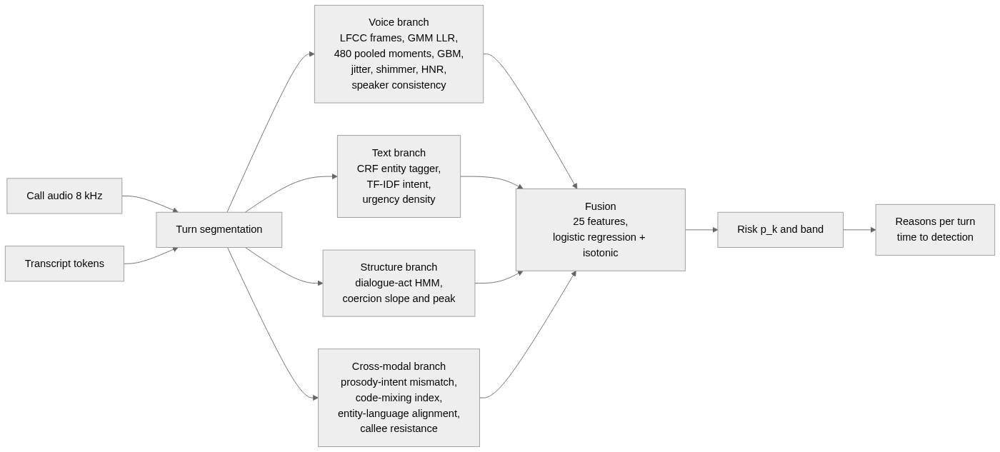

NAME - BHAVYE NIJHAWAN

REG. NO. - 23BAI0100

SPEECH AND LANGUAGE PROCESSING LAB

LAB ASSESSMENT - 6

PROPOSED METHODOLOGY

**Voice Clone Fraud Call Detection: Combining Acoustic Anti Spoofing with Scam Intent Analysis for Hindi-English Calls**

**1. Overview**

The system, called SwarKavach, treats a phone call as a stream of turns. After each turn spoken by the caller, four branches read the call so far and a fusion layer combines them into one risk probability. The four branches are: a voice branch that decides whether the caller's voice is synthetic, a text branch that tags fraud entities and scores scam intent from the transcript, a structure branch that reads the order of dialogue acts as a coercion ramp, and a cross modal branch that measures whether the delivery matches the content. The output after every caller turn is a probability, a band (low, elevated, high, critical), the entity spans found so far, and a list of reasons. An alert is raised when the probability first crosses 0.65.

Figure 1. Information flow from call audio and transcript, through the four branches, to the fused risk and the per turn explanation.

Everything runs at 8 kHz, the telephone sampling rate, on a CPU. The sections below follow the order in which data moves through the system: how the data is built, how the audio is conditioned, what each branch computes, how they are fused, and how the whole thing is evaluated.

**2. Data Construction**

**2.1 The Hinglish call corpus**

No public corpus pairs cloned voice audio with scam and benign scripts in code mixed Hindi-English, so one is generated. A template grammar defines ten scam scenarios (KYC freeze, OTP theft, digital arrest, lottery prize, fake relative, electricity disconnection, courier customs, job offer, loan approval, SIM block) and eight benign ones (bank reminder, delivery OTP, family call, telemarketing, appointment reminder, customer support, survey call, school notice).

Each call is planned before it is rendered. The planner draws the subject of the call first and the label inside it, and draws the voice label independently of the scam label, so that the four cells of human or cloned voice against benign or scam content come out balanced. Speakers are assigned to train, dev and test splits before calls are assigned to speakers, so the splits are speaker disjoint.

A dialogue is an arc of dialogue acts, for example GREET, CONFIRM, IDENTIFY_SELF, PROBLEM_STATE, AUTHORITY_ASSERT, DEADLINE, INSTRUCT, REQUEST_SENSITIVE, VICTIM_COMPLY, CLOSE. For each act a template line is drawn. Templates carry typed slots such as {BANK}, {OTP_WORD} and {DEADLINE}; a slot resolves to a surface string and an entity type at the same time, so the tokens it contributes receive the matching BIO tags and nothing else in the line is touched. Every token also carries a language tag (Hindi, English or universal). Because the labels come from the slots that produced the text, they cannot drift from it. A validator forbids literal entity mentions outside slots.

Two rules keep the label from leaking through the text. Five subjects (a parcel, a bank KYC call, a bank transaction alert, a relative in trouble, a financial offer) each have a scam and a benign scenario that share their setup lines and differ only in what is asked for, so the topic of a call does not predict its label. And greetings, closings, acknowledgements and polite instructions are drawn from one pool used by both classes, so phrasing does not either. Both rules came from a check that is now part of the pipeline: a plain bag of words classifier is trained across speaker folds on the caller text, and if it separates the classes almost perfectly, the grammar is revised before any real model is trained.

The corpus used in the final experiments has 480 calls, 24 speakers, 5,093 turns, about 7.3 hours of audio and 1,289 entity spans across seven types, split 240 / 120 / 120 by speaker. Each caller turn is rendered with a Microsoft neural Hindi or Indian English voice; its rate, pitch and volume are set from the dialogue act. A caller labelled as cloned is rendered with a fixed contour regardless of act; a human labelled caller modulates.

**2.2 The anti spoofing pair set**

The voice branch cannot be trained on the corpus, because both of its voice cells are machine voices. It is trained instead on 600 real Hindi utterances from the public GramVaani corpus, each paired with a neural rendering of its own transcript. Half the renderings are also passed through a vocoder so that the spoof side is not one system.

The two sides of each pair then go down the same channel, in this order: G.711 companding; DC removal; a brick wall band pass from 300 to 2800 Hz, which is the band the real recordings actually occupy; trimming of leading and trailing silence; peak normalisation; and noise matching, in which the quieter side is lifted to the louder side's noise floor using noise shaped like the recording's own quiet frame spectrum. This order matters. An earlier version matched the noise floor on full band, untrimmed audio, and the detector then found the classes separable by bandwidth alone.

Before the set is accepted, a confound audit computes ten statistics per clip (noise floor, dynamic range, zero crossing rate, duration, quiet frame centroid and tilt, energy share above and below the band, trailing silence, DC offset), both on the raw file and after the same conditioning the detector applies, and reports the AUC of each statistic on its own. If any conditioned statistic exceeds 0.75 the build stops. The final set passed at 0.70.

**3. Audio Conditioning**

Every cepstral computation in the voice branch begins with one conditioning function: remove the DC offset; apply a Kaiser windowed FIR band pass from 300 to 2800 Hz with a 100 Hz transition and 60 dB stop band attenuation, run forwards and backwards; trim leading and trailing frames more than 40 dB below the loudest frame; and add dither at 70 dB below the signal so that an exact zero in a stop band cannot be told from a near zero. The conditioned signal is RMS normalised and framed with a 25 ms Hamming window and a 10 ms hop, pre emphasis 0.97. Voiced frames are selected by an energy based activity detector. The same function is used in training, in evaluation and in the live console, so the detector always sees the same kind of signal.

**4. Voice Branch**

Five cepstral front ends are implemented and compared: LFCC, MFCC, GFCC, CQCC and LPCC. Each uses 40 filters between 300 and 2800 Hz and keeps 20 coefficients, with first and second differences appended and cepstral mean and variance normalisation applied per utterance, which removes the additive effect of a fixed channel. Two back ends score an utterance. A pair of Gaussian mixture models, one fitted to bona fide frames and one to spoofed frames with up to 64 components each, gives the mean frame log likelihood ratio. A histogram gradient boosted classifier (220 iterations, learning rate 0.07, depth 4) reads 480 utterance level statistics: the mean, standard deviation, skew and kurtosis of each coefficient and its deltas.

Alongside the detector score, the branch computes pitch jitter, amplitude shimmer, harmonic to noise ratio and spectral flatness variance on the raw signal, and a speaker embedding consistency score that asks whether the caller's turns all come from one voice. Eight numbers leave this branch.

**5. Text Branch**

**5.1 Fraud entity tagging**

A linear chain conditional random field, implemented in the project rather than taken from a library, tags seven entity types in BIO form: OTP, BANK_ENTITY, AUTHORITY_CLAIM, THREAT_DEADLINE, PAYMENT_HANDLE, PERSONAL_INFO_REQ and MONEY_AMOUNT. Its features are the token, its shape, prefixes and suffixes, the neighbouring tokens, and the token's language tag. It is trained with L2 regularisation 0.5 for 200 iterations on the train split. Entity counts per type, divided by the number of turns so far, become six density features.

**5.2 Scam intent**

Each turn is represented by TF-IDF over word unigrams and bigrams together with character 3 to 5 grams inside word boundaries. The character n grams are what let the classifier survive the spelling variation of romanised Hindi. A class balanced logistic regression with C = 4.0 gives a per turn probability; the call score is 0.6 times the maximum turn score plus 0.4 times the mean. A lexicon rule baseline that counts fraud words is kept for comparison. The intent score, the peak turn score and an urgency word density leave this branch, nine numbers in all with the entity densities.

**6. Structure Branch**

Each dialogue act carries a coercion rank between 0 and 1: greeting 0.0, identification 0.1, problem statement 0.35, authority claim 0.55, threat 0.8, deadline 0.85, isolation 0.9, request for sensitive information 0.95, pressure escalation 1.0. Across the caller's turns, the least squares slope of rank against turn index is the coercion slope and the maximum is the coercion peak. The slope is what separates a call that built pressure from one that merely mentioned a deadline. A hidden Markov model over acts is fitted separately on scam and benign calls, and the log likelihood ratio of the observed act sequence under the two models is a third feature.

**7. Cross Modal Branch**

**7.1 Prosody intent mismatch**

For each caller turn, an acoustic arousal score in [0, 1] is built from four prosodic measures: pitch coefficient of variation, pitch span relative to the mean, the variance of syllable peak levels in dB, and the variation of syllable rate across the turn. Each is scaled between anchors at the 10th and 90th percentile of the training audio and combined with weights 0.34, 0.24, 0.26 and 0.16. A lexical arousal score for the same turn comes from the fraud lexicon and the intent model. The mismatch over a call is 0.65 times the weighted mean of the positive gap between lexical and acoustic arousal, plus 0.35 times one minus their correlation, scaled to [0, 1] and gated by the peak lexical pressure so that a call with no coercive language cannot score on correlation noise.

**7.2 Language and callee features**

The code mixing index of a call is one minus the share of the dominant language among language bearing tokens. Switch entropy and the fraction of entity tokens whose language matches their surrounding turn complete the language features. Callee resistance is the fraction of callee turns tagged as resisting. Eight numbers leave this branch.

**8. Fusion and Streaming Decision**

The twenty five features from the four branches enter a logistic regression with C = 0.7 and balanced class weights, wrapped in isotonic calibration so that the output can be read as a probability. The fusion layer is fitted on the dev split, never on train, because it stacks on top of branch outputs and fitting it on rows the branches trained on would feed it in sample predictions that never occur at test time.

After each caller turn the features are recomputed over all caller audio and text so far, the probability is produced, and a band is assigned at 0.35, 0.65 and 0.85. Time to detection is the end time of the first caller turn at which the probability reaches 0.65. Reasons are generated per turn from the sign and size of each branch's contribution, in plain language, for example "the voice scores 0.99 on the synthetic speech detector" or "a request for an OTP followed a threat with a deadline".

**9. Evaluation Plan**

Every reported number comes from the test split or from data outside the training distribution.

- Ablation. Four arms are fitted on the same 120 dev calls and scored on the same 120 test calls: audio only (8 voice features), text only (9 intent features), late fusion (one calibrated score per branch, then a logistic layer), and full (all 25). AUC, F1, accuracy and EER are reported overall, per cell, and on the hard subset of lexically mild scams against benign calls written to sound like scams.
- Voice branch. EER for each front end and back end on the 310 test clips of the pair set, under clean, G.711 mu law, G.711 A law and GSM 06.10 conditions, read next to the confound audit table.
- Entity recognition. Precision, recall and F1 with exact span matching, per type.
- Intent. AUC and F1 for the rule baseline and the TF-IDF model.
- Generalisation. Recall at 0.65 and cross domain AUC of the intent model on 1,413 real recorded robocalls, with the project's own benign calls as controls.
- Time to detection. Median, 90th percentile and turns to alert on the test scam calls, per scenario.
- Robustness. AUC of the full and audio only arms under each codec.
- Calibration. Brier score and expected calibration error on the test split.
- Deployment. Per call latency by branch on a laptop CPU.

**10. Tools and Environment**

Python with NumPy and SciPy for signal processing; scikit-learn for logistic regression, isotonic calibration, Gaussian mixtures and gradient boosting; the CRF, cepstral front ends, pitch tracker, syllable segmenter and dialogue act HMM written in the project; edge-tts for neural voices; FFmpeg for the GSM codec, with G.711 implemented directly; Flask for the console. Training and evaluation run on a Google Colab CPU runtime with every stage checkpointed to Drive; the console runs on a laptop with 8 GB of RAM. The corpus manifest records a fingerprint of the grammar and the pair manifest a build version, and the runner refuses to reuse a corpus or pair set that does not match the checked out code, so a change to the templates or the matching always reaches the models.

**11. References**

1. Wang X., Delgado H., Tak H., et al. (2024). ASVspoof 5: Crowdsourced speech data, deepfakes, and adversarial attacks at scale. Proc. ASVspoof Workshop 2024.
2. Zhu Y., Koppisetti S., Tran T., Bharaj G. (2024). SLIM: Style-linguistics mismatch model for generalized audio deepfake detection. Proc. NeurIPS 2024.
3. Sharma D. V., Ekbote V., Gupta A. (2025). IndicSynth: A large-scale multilingual synthetic speech dataset for low-resource Indian languages. Proc. ACL 2025.
4. Shen Z., Yan S., Zhang Y., Luo X., Ngai G., Fu E. Y. (2025). "It warned me just at the right moment": Exploring LLM-based real-time detection of phone scams. arXiv:2502.03964.
5. Ma Z., Wang P., Huang M., et al. (2025). TeleAntiFraud-28k: An audio-text slow-thinking dataset for telecom fraud detection. arXiv:2503.24115.
6. Yi J., Wang C., Tao J., Zhang X., Zhang C. Y., Zhao Y. (2023). Audio deepfake detection: A survey. arXiv:2308.14970.
