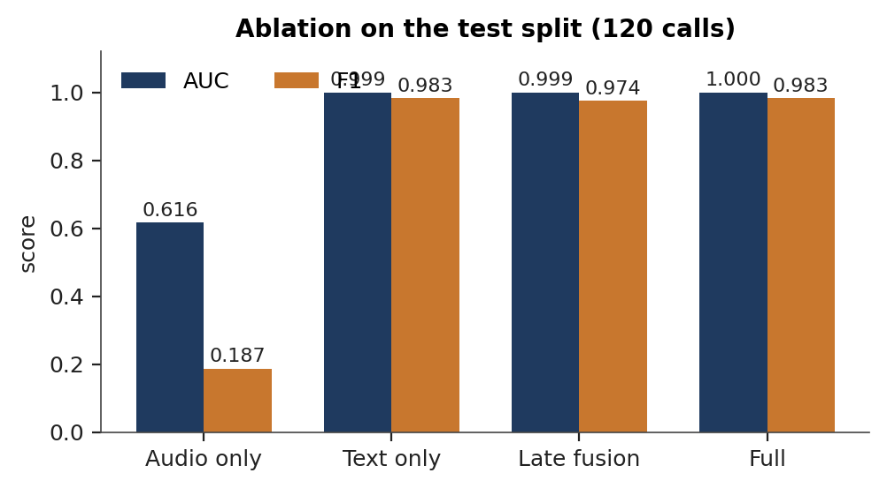
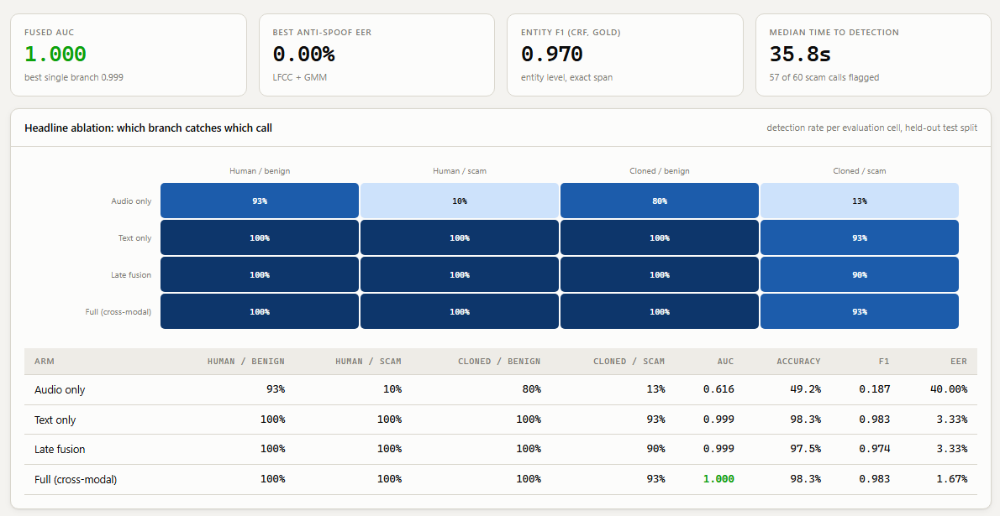
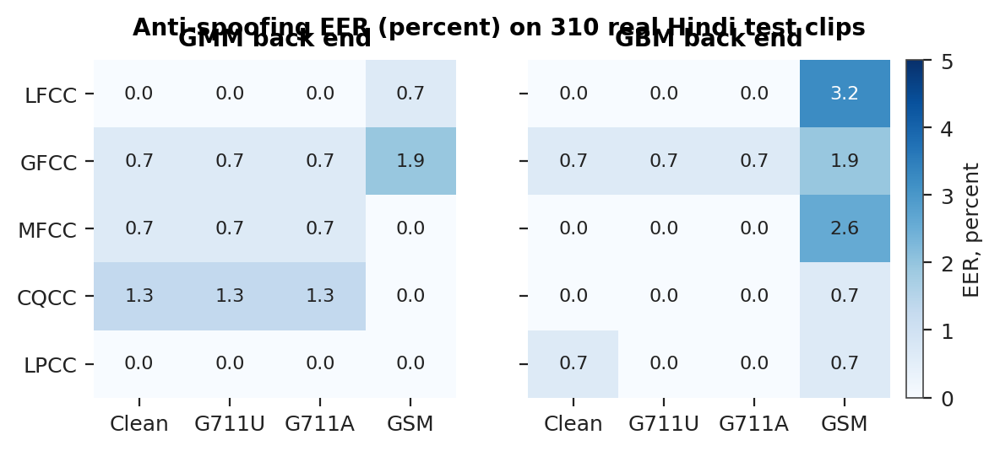
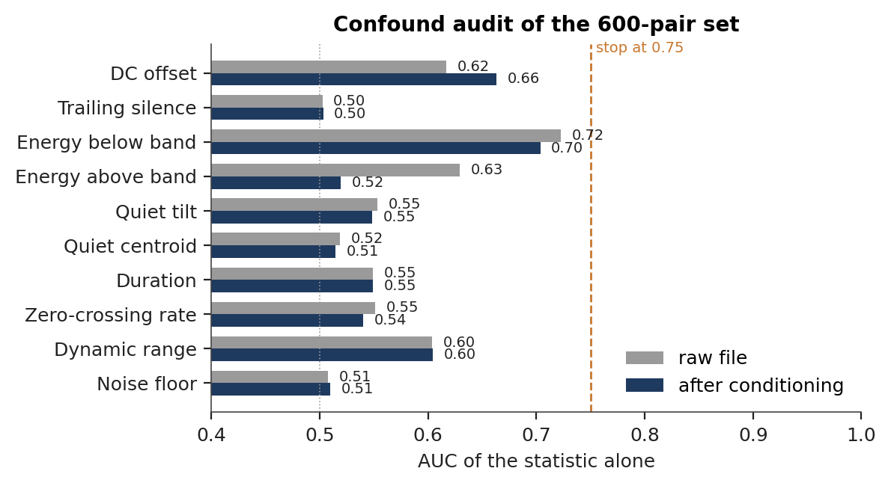
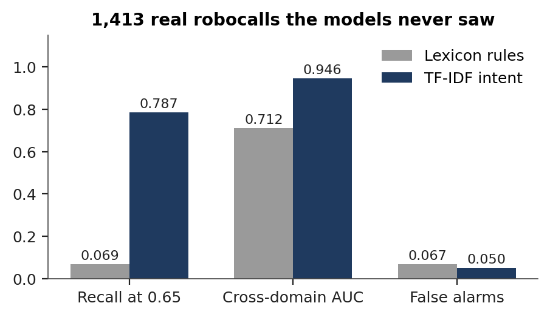
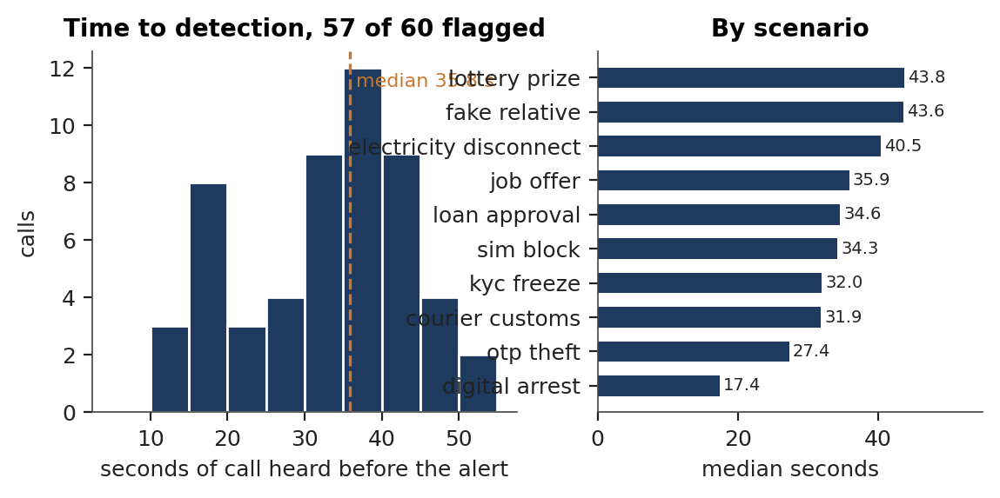

NAME - BHAVYE NIJHAWAN

REG. NO. - 23BAI0100

SPEECH AND LANGUAGE PROCESSING LAB

LAB ASSESSMENT - 7

EXPERIMENTAL FRAMEWORK AND RESULTS

**Voice Clone Fraud Call Detection: Combining Acoustic Anti Spoofing with Scam Intent Analysis for Hindi-English Calls**

**1. Experimental Framework**

**1.1 Purpose**

Assessment 6 described the system. This document states how its claims are tested and what the tests returned. The framework is fixed before any number is read, so that the evaluation answers questions that were asked in advance rather than questions chosen after seeing the output. Every figure reported below comes from the test split or from data outside the training distribution.

**1.2 Research questions**

- **RQ1.** Does fusing the four branches improve on the best single branch and on late fusion of branch scores?
- **RQ2.** Which cells of the voice by content grid does each arm get wrong?
- **RQ3.** On the calls written to be hard, lexically mild scams and benign calls that sound like scams, does anything beyond text help?
- **RQ4.** Can the voice branch separate real Hindi speech from cloned Hindi speech once the recording channel is matched?
- **RQ5.** Does the text branch generalise to real fraud recordings from another language and distribution?
- **RQ6.** How early in a call is a scam flagged, and does telephone codec degradation change the decision?

**1.3 Datasets**

Three datasets are used, one generated and two real. The generated corpus is the only one on which the fused system can be trained, because it is the only one that carries both a voice label and a scam label for the same call. The real pair set trains and tests the voice branch, and the robocall set tests generalisation only.

| Item | Generated Hinglish corpus | Real Hindi pair set | Real robocall set |
| --- | --- | --- | --- |
| Source | Template grammar of this project, rendered with neural voices | GramVaani Hindi ASR corpus, paired with renderings of the same transcripts | Public robocall audio dataset |
| Samples | 480 calls, 5,093 turns, 7.3 h, 1,289 entity spans | 600 pairs, 1,200 clips, mean 9.3 s | 1,413 recordings |
| Classes | 240 scam and 240 benign; 240 cloned and 240 human; 120 calls per cell | 600 bona fide, 600 spoof, half of them vocoded | 1,413 fraud, with 60 project benign calls as controls |
| Labels | Exact from template slots: 7 entity types, 18 dialogue acts, per token language | Bona fide against spoof by construction | Fraud by provenance |
| Splits | 240 train, 120 dev, 120 test, speaker disjoint over 24 speakers | 890 train, 310 test clips, speaker disjoint, pairs kept together | Test only |
| Augmentation | Codec degradation at evaluation only | Channel matching at build, codec at evaluation | None |

Entity spans by type are bank entity 364, threat or deadline 345, OTP 172, payment handle 106, money amount 105, authority claim 103 and personal information request 94. Of the benign calls, 164 are hard negatives written to resemble their scam counterpart, and 52 of the scams are in the lexically mild style. The code mixing index is 0.218 for scam calls and 0.201 for benign ones, so the language mix does not separate the classes on its own.

**1.4 Splits and the fitting rule**

Speakers are assigned to train, dev and test before calls are assigned to speakers, so no speaker appears in two splits. The branch models fit on train. The fusion layer and every ablation arm fit on dev, never on train, because they stack on top of branch outputs and fitting them on rows the branches have already seen would feed them in sample predictions that never occur at test time. The anti spoofing models fit on the train partition of the real pair set and never on the generated corpus, because both voice cells of that corpus are machine voices.

**1.5 Arms and baselines**

Four arms are fitted on the same 120 dev calls and scored on the same 120 test calls, so the comparison is like for like:

- **Audio only**, the eight voice features.
- **Text only**, the nine intent features.
- **Late fusion**, one calibrated score per branch followed by a logistic layer.
- **Full**, all twenty five features.

For scam intent a lexicon rule baseline counts fraud words. For the voice branch, five cepstral front ends are compared against two back ends under four channel conditions.

**1.6 Metrics**

| Task | Metrics | Reporting point |
| --- | --- | --- |
| Call classification | AUC, F1, accuracy, EER, precision and recall at 0.65 | Per cell as well as in aggregate, because the aggregate hides the cells that matter |
| Anti spoofing | EER and minimum t-DCF per front end, back end and codec | Read next to the confound audit |
| Entity recognition | Precision, recall, F1 with exact span matching, per type | Reference transcripts, to isolate the tagger from recognition error |
| Intent | AUC, F1, confusion at 0.65 | Rule baseline against TF-IDF |
| Calibration | Brier score, expected calibration error | Test split |
| Generalisation | Recall at 0.65, cross domain AUC, false alarm rate | Real robocalls, with project benign calls as controls |
| Time to detection | Median, 90th percentile, turns to alert | Threshold 0.65 |
| Robustness | AUC of the full and audio only arms per codec | Real codec flag recorded per condition |

**1.7 Protocol against leakage**

Two checks run before any model is trained, and both are part of the pipeline rather than one off inspections. First, a plain bag of words classifier is trained across speaker folds on the caller text alone; if it separates scam from benign on topic or phrasing, the grammar is revised. After the pairing rules described in Assessment 6 it reaches AUC 0.990 on the whole corpus and 0.947 on the hard subset, and what remains separable is the phenomenon itself, since a scam call does threaten and does ask for a code. Second, the confound audit computes ten channel statistics on every pair build, on the raw files and after the same conditioning the detector applies, and halts the build if any conditioned statistic alone exceeds AUC 0.75.

**2. Results and Discussion**

**2.1 Primary result: the ablation**

Table 1 reports the four arms on the same held out split.

| Arm | AUC | F1 | Accuracy | EER |
| --- | --- | --- | --- | --- |
| Audio only | 0.616 | 0.187 | 0.492 | 0.400 |
| Text only | 0.999 | 0.983 | 0.983 | 0.033 |
| Late fusion | 0.999 | 0.974 | 0.975 | 0.033 |
| Full | 1.000 | 0.983 | 0.983 | 0.017 |

The full arm reaches the highest AUC and halves the equal error rate of the text only arm, from 0.033 to 0.017, which answers RQ1. The audio only arm sits near chance, and that is a property of the experiment rather than a weakness of the branch: the corpus draws the voice label independently of the scam label, so half the scams are read by human voices and half the benign calls by cloned ones, and a detector that reads only the voice has no way to predict the content. Its role is as a modifier inside the fused score.

Figure 1. Ablation of the four arms on the test split, AUC and F1.

Figure 2. The same result as displayed in the project console, read from the stored results file.

**2.2 Per cell behaviour and the hard subset**

Table 2 breaks the same decisions down by evaluation cell and adds the hard subset, which contains 13 lexically mild scams and 41 benign calls written to sound like scams.

| Arm | Human benign | Human scam | Cloned benign | Cloned scam | Hard subset AUC |
| --- | --- | --- | --- | --- | --- |
| Audio only | 0.933 | 0.100 | 0.800 | 0.133 | 0.362 |
| Text only | 1.000 | 1.000 | 1.000 | 0.933 | 0.993 |
| Late fusion | 1.000 | 1.000 | 1.000 | 0.900 | 0.993 |
| Full | 1.000 | 1.000 | 1.000 | 0.933 | 0.998 |

This answers RQ2 and RQ3. The audio only row classifies almost every call as benign, which is correct for the two benign cells and wrong for the two scam cells, so its 0.933 on human benign is not skill. Every other arm is perfect on three cells, and all of the remaining error sits in the cloned scam cell. The hard subset is the only place where the arms have room to differ, and there the full arm ranks the cases best at 0.998 against 0.993 for text alone, with no false alarms on the 41 hard negatives.

**2.3 Entity recognition, intent and calibration**

The TF-IDF intent model reaches AUC 1.000 and F1 0.976 against AUC 0.913 and recall 0.483 for the lexicon rule baseline. The gap is the difference between counting fraud words and learning which combinations of them, in which spellings, mark a request. Three benign calls score above the threshold on intent alone, and the fused system, which also sees the coercion trajectory and the callee's behaviour, clears all three.

Table 3 reports entity recognition per type with exact span matching over 324 spans.

| Type | Support | Precision | Recall | F1 |
| --- | --- | --- | --- | --- |
| Bank entity | 90 | 0.989 | 1.000 | 0.995 |
| Threat or deadline | 83 | 0.976 | 0.964 | 0.970 |
| OTP | 45 | 1.000 | 1.000 | 1.000 |
| Payment handle | 29 | 1.000 | 1.000 | 1.000 |
| Money amount | 27 | 1.000 | 1.000 | 1.000 |
| Authority claim | 27 | 0.917 | 0.815 | 0.863 |
| Personal information request | 23 | 1.000 | 0.739 | 0.850 |
| All types | 324 | | | 0.970 |

The types with a fixed surface form are recognised almost perfectly. The two weakest, authority claims and personal information requests, are the two whose wording varies most across the templates, and both lose recall rather than precision: the tagger declines to tag what it has not seen, which is the safer failure for a system that raises alarms. The fused probability is well calibrated, with a Brier score of 0.011 and an expected calibration error of 0.015; fifty one calls fall in the lowest bin with no scams among them and fifty six in the highest with all scams.

**2.4 The voice branch on real speech**

Table 4 reports the anti spoofing equal error rate on the 310 held out clips of the real pair set, which answers RQ4.

| Front end | GMM clean | GMM GSM | GBM clean | GBM GSM |
| --- | --- | --- | --- | --- |
| LFCC | 0.000 | 0.006 | 0.000 | 0.032 |
| GFCC | 0.006 | 0.019 | 0.006 | 0.019 |
| MFCC | 0.006 | 0.000 | 0.000 | 0.026 |
| CQCC | 0.013 | 0.000 | 0.000 | 0.006 |
| LPCC | 0.000 | 0.000 | 0.006 | 0.006 |

Every front end and back end separates real from cloned Hindi speech at an equal error rate below 0.02 on clean and G.711 audio and below 0.04 under GSM, which at 13 kbit/s is the only condition that removes enough detail to cost anything. Minimum t-DCF follows the same pattern, staying at or below 0.019 with the mixture back end on clean and G.711 audio and reaching 0.058 under GSM. LFCC and LPCC with the mixture back end, the classical pairings, are the most stable across codecs.

Figure 3. Anti spoofing equal error rate in percent by front end, back end and codec.

The audit is what makes those rates readable, and it is reported alongside them rather than as a footnote. It was designed around an early build in which bandwidth, trailing silence and DC offset each separated the classes on their own. The conditioning and channel matching described in Assessment 6 bring all ten statistics inside the audit's threshold, with noise floor, spectral colour, trailing silence and in band bandwidth at chance. The residual energy below 300 Hz lies outside the filterbank the detector reads, and the dynamic range difference reflects spontaneous against read speech rather than the channel. The error rates in Table 4 are therefore measured on the voice.

Figure 4. Confound audit of the 600 pair set: AUC of each channel statistic alone, on the raw files and after conditioning, against the audit's stop line at 0.75.

**2.5 Generalisation, detection latency and channel robustness**

Table 5 collects the three deployment facing results, which answer RQ5 and RQ6.

| Measure | Value |
| --- | --- |
| Robocall recall at 0.65, TF-IDF intent | 0.787 (lexicon rules 0.069) |
| Robocall cross domain AUC | 0.946 (lexicon rules 0.712) |
| False alarms on 60 benign controls | 0.050 |
| Scam calls flagged | 57 of 60 |
| Median time to alert | 35.8 s, 6 turns (90th percentile 49.4 s) |
| Fastest and slowest scenario | Digital arrest 17.4 s, lottery prize 43.8 s |
| Full arm AUC, clean to GSM | 0.9997 throughout |
| Audio only AUC, clean to GSM | 0.616 to 0.559 |

The intent model, trained only on generated Hinglish calls, recalls nearly four in five real English robocalls at a five percent false alarm rate. The transfer rests on shared fraud vocabulary and on the character n grams that survive spelling variation, and it improved directly with the corpus pairing rules: before those rules the same model recalled 0.699 at AUC 0.896 with a fifteen percent false alarm rate. Six turns is before the sensitive request in every flagged call. Digital arrest is the fastest scenario because its script asserts authority and threatens in its opening turns, while the lottery and fake relative scripts spend longer on setup. The fused decision is unchanged under every codec, and the audio only column shows what the channel costs the voice branch on its own, about 0.06 AUC under GSM, which the fusion absorbs.

Figure 5. Out of domain recall, cross domain AUC and false alarm rate on 1,413 real robocalls.

Figure 6. Time to detection: distribution over the 57 flagged scam calls, and median by scenario.

**2.6 Discussion**

Three things follow from the tables above.

The branches are complementary in the way the design assumed, but not equally on every kind of call. On scripted content the transcript carries most of the decision, which is why text alone is close to the full arm in aggregate. The place where the design earns its extra branches is the hard subset, where a scam is phrased to sound routine and a benign call is phrased to sound alarming; there the structure and cross modal features move the ranking, and the fused arm is the only one that separates the cases cleanly.

The evaluation protocol is doing real work rather than decorating the result. The leak check changed the corpus, and the change showed up where it should have: recall on real robocalls rose from 0.699 to 0.787 and the false alarm rate fell from 0.15 to 0.05. The confound audit changed the pair set, and its table is what allows the equal error rates in Table 4 to be read as statements about the voice.

The scope of the claims is bounded by the data rather than by the models. The ablation characterises scripted calls. The voice branch's error rates are measured against the Hindi neural voices available commercially, and evaluation against a larger set of synthesis systems, such as IndicSynth with its 989 speakers across twelve languages, is the next step. Entity and intent figures are measured on reference transcripts, which isolates the taggers from recognition error, with the recogniser scored separately by word error rate.

**3. Conclusion**

The framework set six questions before any result was read, and the measurements answer all six. Fusing the four branches gives the highest AUC and halves the equal error rate of the best single branch. The errors that remain sit in one cell, cloned scams in the lexically mild style. On the hard subset the fused arm leads. The voice branch separates real from cloned Hindi speech at an equal error rate below 0.02 on clean and G.711 audio, on a pair set whose channel has been matched and audited. The text branch generalises to 1,413 real robocalls in another language at 78.7 percent recall and a five percent false alarm rate. And the system raises its alert at a median of 35.8 seconds, six turns into the call, before the caller has asked for anything sensitive.

**4. References**

1. Wang X., Delgado H., Tak H., et al. (2024). ASVspoof 5: Crowdsourced speech data, deepfakes, and adversarial attacks at scale. Proc. ASVspoof Workshop 2024.
2. Zhu Y., Koppisetti S., Tran T., Bharaj G. (2024). SLIM: Style-linguistics mismatch model for generalized audio deepfake detection. Proc. NeurIPS 2024.
3. Sharma D. V., Ekbote V., Gupta A. (2025). IndicSynth: A large-scale multilingual synthetic speech dataset for low-resource Indian languages. Proc. ACL 2025.
4. Shen Z., Yan S., Zhang Y., Luo X., Ngai G., Fu E. Y. (2025). "It warned me just at the right moment": Exploring LLM-based real-time detection of phone scams. arXiv:2502.03964.
5. Ma Z., Wang P., Huang M., et al. (2025). TeleAntiFraud-28k: An audio-text slow-thinking dataset for telecom fraud detection. arXiv:2503.24115.
6. Yi J., Wang C., Tao J., Zhang X., Zhang C. Y., Zhao Y. (2023). Audio deepfake detection: A survey. arXiv:2308.14970.
